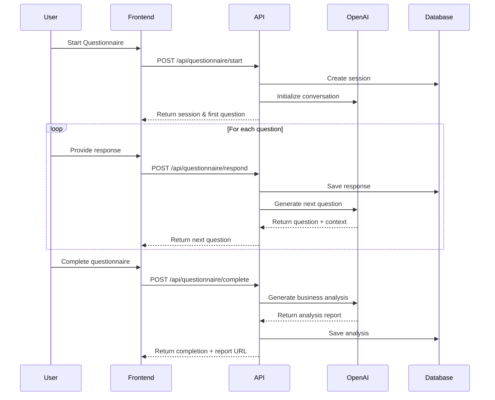
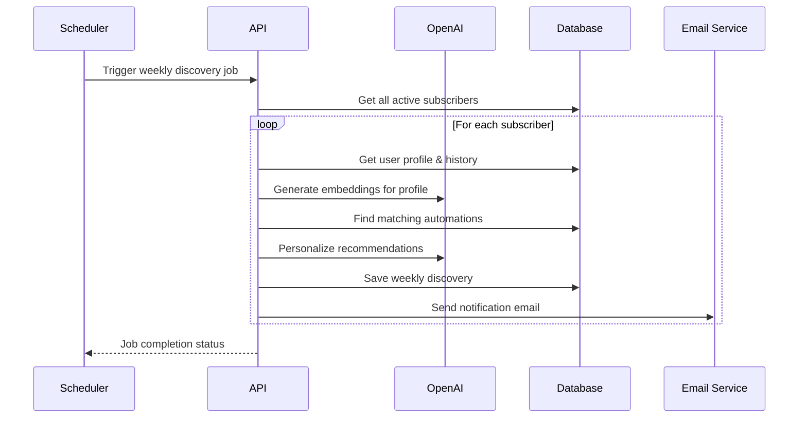

# 7. Core Workflows

## Questionnaire Flow

```mermaid
sequenceDiagram
    participant U as User
    participant F as Frontend
    participant A as API
    participant AI as OpenAI
    participant DB as Database

    U->>F: Start Questionnaire
    F->>A: POST /api/questionnaire/start
    A->>DB: Create session
    A->>AI: Initialize conversation
    A-->>F: Return session & first question
    
    loop For each question
        U->>F: Provide response
        F->>A: POST /api/questionnaire/respond
        A->>DB: Save response
        A->>AI: Generate next question
        AI-->>A: Return question + context
        A-->>F: Return next question
    end
    
    U->>F: Complete questionnaire
    F->>A: POST /api/questionnaire/complete
    A->>AI: Generate business analysis
    AI-->>A: Return analysis report
    A->>DB: Save analysis
    A-->>F: Return completion + report URL
```

## Weekly Discovery Generation

```mermaid
sequenceDiagram
    participant S as Scheduler
    participant A as API
    participant AI as OpenAI
    participant DB as Database
    participant E as Email Service

    S->>A: Trigger weekly discovery job
    A->>DB: Get all active subscribers
    
    loop For each subscriber
        A->>DB: Get user profile & history
        A->>AI: Generate embeddings for profile
        A->>DB: Find matching automations
        A->>AI: Personalize recommendations
        A->>DB: Save weekly discovery
        A->>E: Send notification email
    end
    
    A-->>S: Job completion status
```

---
