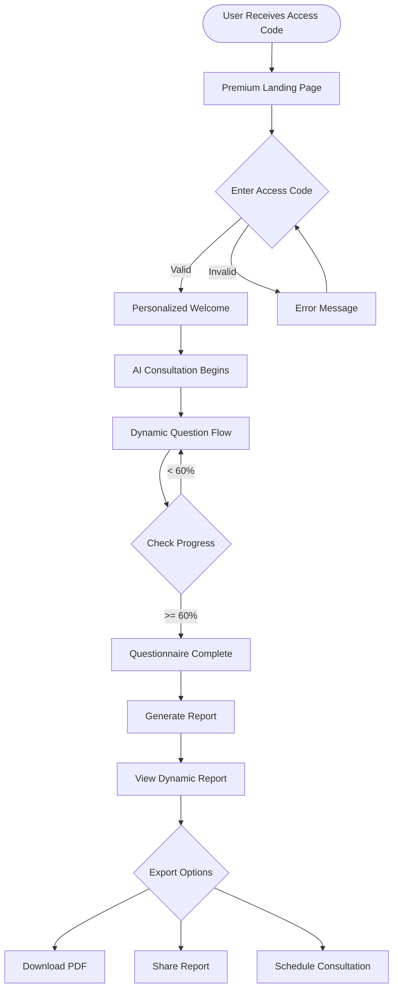

# Premium Questionnaire User Flows
**For:** Kevin & Joe  
**Date:** August 20, 2025  
**Purpose:** Visual mapping of the complete user journey through the premium consultation system

---

## 1. Master User Flow Overview



---

## 2. Premium Access & Onboarding Flow

### Flow A: First-Time Member Access
```
┌─────────────────────────────────────────────────────────────┐
│                     ENTRY POINTS                            │
├─────────────────────────────────────────────────────────────┤
│ • Email with access code from ClockworkCoaching            │
│ • Direct link from member portal                           │
│ • QR code from physical materials                          │
└────────────────────────┬────────────────────────────────────┘
                         ▼
┌─────────────────────────────────────────────────────────────┐
│                  PREMIUM LANDING PAGE                       │
├─────────────────────────────────────────────────────────────┤
│ • $2,500+ value messaging                                  │
│ • Exclusive member benefits                                │
│ • Trust indicators & testimonials                          │
│ • Access code input field                                  │
└────────────────────────┬────────────────────────────────────┘
                         ▼
┌─────────────────────────────────────────────────────────────┐
│                  ACCESS CODE VALIDATION                     │
├─────────────────────────────────────────────────────────────┤
│ Format Check → CLOCK-XXXX-XXXX                             │
│     ├─ Invalid Format → Show format helper                 │
│     └─ Valid Format → Proceed to validation                │
│                                                             │
│ Database Validation:                                       │
│     ├─ Code Not Found → "Check your code" message         │
│     ├─ Code Expired → "Contact support" + help link       │
│     ├─ Code Used → "Already redeemed" + session link      │
│     └─ Code Valid → Create session & proceed              │
└────────────────────────┬────────────────────────────────────┘
                         ▼
┌─────────────────────────────────────────────────────────────┐
│                  PERSONALIZED WELCOME                       │
├─────────────────────────────────────────────────────────────┤
│ • "Welcome, [Member Name]!" greeting                       │
│ • VIP status badge display                                 │
│ • Consultation value reminder                              │
│ • Expected time (12-15 minutes)                            │
│ • [Begin Consultation] CTA                                 │
└─────────────────────────────────────────────────────────────┘
```

### Flow B: Returning Member
```
┌─────────────────────────────────────────────────────────────┐
│                   RETURNING MEMBER                          │
├─────────────────────────────────────────────────────────────┤
│ Has Valid Session Cookie?                                  │
│     ├─ Yes → Check Progress                                │
│     │        ├─ In Progress → Resume Questionnaire        │
│     │        └─ Complete → View Report                    │
│     └─ No → Return to Landing Page                        │
└─────────────────────────────────────────────────────────────┘
```

---

## 3. AI Consultation & Question Flow

### Intelligent Conversation Flow
```
┌─────────────────────────────────────────────────────────────┐
│                    START CONSULTATION                       │
├─────────────────────────────────────────────────────────────┤
│ AI: Warm greeting with member name                         │
│ "Hi Sarah! I'm excited to help you discover..."           │
└────────────────────────┬────────────────────────────────────┘
                         ▼
┌─────────────────────────────────────────────────────────────┐
│              SECTION 1: BUSINESS FOUNDATION                 │
│                    (15% weight, Required)                   │
├─────────────────────────────────────────────────────────────┤
│ Question Loop:                                             │
│ 1. AI selects next unanswered question                     │
│ 2. Checks if info already extracted                        │
│ 3. Contextualizes question based on previous answers       │
│ 4. Presents with quick response options                    │
│                                                             │
│ User Response:                                             │
│     ├─ Text Input → Extract all business data             │
│     └─ Quick Response → Store selection                   │
│                                                             │
│ AI Processing:                                             │
│ 1. Extract metrics (GCI, transactions, etc.)              │
│ 2. Identify pain points and goals                         │
│ 3. Compare to benchmarks                                  │
│ 4. Generate encouraging response                          │
│ 5. Celebrate achievements ("Top 5%!")                     │
│                                                             │
│ Progress Update:                                           │
│ • Update section completion (7/8 questions)               │
│ • Calculate weighted progress                             │
│ • Check section completion criteria                       │
└────────────────────────┬────────────────────────────────────┘
                         ▼
┌─────────────────────────────────────────────────────────────┐
│                 SECTION TRANSITION                          │
├─────────────────────────────────────────────────────────────┤
│ Completion Check:                                          │
│     ├─ Section < 80% → Continue current section           │
│     └─ Section >= 80% → Transition to next                │
│                                                             │
│ Transition Message:                                        │
│ "Great insights about your foundation! Now let's          │
│  explore your current systems and tools..."               │
└────────────────────────┬────────────────────────────────────┘
                         ▼
        [Repeat for all 7 sections with smart routing]
                         ▼
┌─────────────────────────────────────────────────────────────┐
│                  COMPLETION DETECTION                       │
├─────────────────────────────────────────────────────────────┤
│ Minimum Threshold Check:                                   │
│     ├─ Overall < 60% → Continue required sections         │
│     └─ Overall >= 60% → Offer completion or continue      │
│                                                             │
│ User Choice:                                               │
│     ├─ Continue → Present optional sections               │
│     └─ Complete → Proceed to report generation            │
└─────────────────────────────────────────────────────────────┘
```

### Question Selection Algorithm
```
┌─────────────────────────────────────────────────────────────┐
│                 SMART QUESTION SELECTION                    │
├─────────────────────────────────────────────────────────────┤
│ For Each Question:                                         │
│                                                             │
│ 1. Check Existing Context                                  │
│    └─ Has user already provided this info? → Skip         │
│                                                             │
│ 2. Check Dependencies                                      │
│    └─ Are prerequisite questions answered? → Eligible     │
│                                                             │
│ 3. Apply Business Logic                                    │
│    ├─ Solo Agent → Use solo variations                    │
│    ├─ Team Lead → Use team variations                     │
│    └─ Enterprise → Use enterprise variations              │
│                                                             │
│ 4. Priority Scoring                                        │
│    ├─ Required questions → Priority 1                     │
│    ├─ High-impact questions → Priority 2                  │
│    └─ Optional enrichment → Priority 3                    │
│                                                             │
│ 5. Select Next Question                                    │
│    └─ Highest priority unanswered question                │
└─────────────────────────────────────────────────────────────┘
```

---

## 4. Report Generation & Delivery Flow

### Dynamic Report Creation
```
┌─────────────────────────────────────────────────────────────┐
│                  QUESTIONNAIRE COMPLETE                     │
├─────────────────────────────────────────────────────────────┤
│ Show Completion Celebration                                │
│ • Confetti animation                                       │
│ • "Congratulations, [Name]!"                               │
│ • Summary of insights gathered                             │
│ • [Generate My Report] CTA                                 │
└────────────────────────┬────────────────────────────────────┘
                         ▼
┌─────────────────────────────────────────────────────────────┐
│                   REPORT GENERATION                         │
├─────────────────────────────────────────────────────────────┤
│ Loading State (3-5 seconds):                               │
│ • "Analyzing your business profile..."                     │
│ • "Calculating automation opportunities..."                │
│ • "Generating personalized recommendations..."             │
│ • Progress bar animation                                   │
│                                                             │
│ Backend Processing:                                        │
│ 1. Load conversation context from database                 │
│ 2. Extract business profile metrics                        │
│ 3. Calculate automation score (0-100)                      │
│ 4. Fetch Reservoir recommendations                         │
│ 5. Calculate ROI projections                               │
│ 6. Generate implementation roadmap                         │
│ 7. Create competitive analysis                             │
│ 8. Compile into report structure                           │
└────────────────────────┬────────────────────────────────────┘
                         ▼
┌─────────────────────────────────────────────────────────────┐
│                    REPORT PRESENTATION                      │
├─────────────────────────────────────────────────────────────┤
│ Interactive Report Sections:                               │
│ • Executive Summary with score                             │
│ • Current State Analysis                                   │
│ • Opportunity Cards (expandable)                           │
│ • ROI Projections (interactive)                            │
│ • Implementation Roadmap                                   │
│ • Next Steps & CTAs                                        │
│                                                             │
│ User Actions:                                              │
│     ├─ Explore Sections → Expand/collapse details         │
│     ├─ Export PDF → Generate & download                   │
│     ├─ Share Report → Copy link or email                  │
│     └─ Schedule Call → Calendar integration               │
└─────────────────────────────────────────────────────────────┘
```

---

## 5. Error Recovery & Edge Cases

### Session Management
```
┌─────────────────────────────────────────────────────────────┐
│                    SESSION TIMEOUT                          │
├─────────────────────────────────────────────────────────────┤
│ After 30 minutes inactive:                                 │
│ 1. Show warning modal (2 min before timeout)               │
│ 2. Auto-save current progress                              │
│ 3. On timeout → Show session expired message               │
│ 4. Offer to resume with access code                        │
└─────────────────────────────────────────────────────────────┘

┌─────────────────────────────────────────────────────────────┐
│                    NETWORK FAILURE                          │
├─────────────────────────────────────────────────────────────┤
│ API Call Fails:                                            │
│ 1. Retry with exponential backoff (3 attempts)            │
│ 2. Show user-friendly error message                        │
│ 3. Save responses locally                                  │
│ 4. Offer manual retry option                               │
│ 5. Fallback to cached content if available                │
└─────────────────────────────────────────────────────────────┘

┌─────────────────────────────────────────────────────────────┐
│                   BROWSER REFRESH                           │
├─────────────────────────────────────────────────────────────┤
│ Page Refresh During Questionnaire:                         │
│ 1. Check session storage for progress                      │
│ 2. Validate session with backend                           │
│ 3. Resume at last answered question                        │
│ 4. Show "Welcome back" message                             │
│ 5. Display progress restored notification                  │
└─────────────────────────────────────────────────────────────┘
```

---

## 6. Mobile-Specific User Flows

### Mobile Access Flow
```
┌─────────────────────────────────────────────────────────────┐
│                   MOBILE LANDING                            │
├─────────────────────────────────────────────────────────────┤
│ Optimized for thumb reach:                                 │
│ • Larger touch targets (min 44px)                          │
│ • Bottom sheet for access code                             │
│ • Simplified navigation                                    │
└────────────────────────┬────────────────────────────────────┘
                         ▼
┌─────────────────────────────────────────────────────────────┐
│                 MOBILE QUESTIONNAIRE                        │
├─────────────────────────────────────────────────────────────┤
│ Adapted Interface:                                         │
│ • Single question per screen                               │
│ • Swipe between questions                                  │
│ • Collapsible progress indicator                           │
│ • Voice input option                                       │
│ • Quick response chips in thumb zone                       │
└────────────────────────┬────────────────────────────────────┘
                         ▼
┌─────────────────────────────────────────────────────────────┐
│                   MOBILE REPORT                             │
├─────────────────────────────────────────────────────────────┤
│ Mobile-First Presentation:                                 │
│ • Vertical card stack                                      │
│ • Swipeable opportunity cards                              │
│ • Tap to expand sections                                   │
│ • Share via native apps                                    │
│ • Save to device options                                   │
└─────────────────────────────────────────────────────────────┘
```

---

## 7. Conversion Optimization Points

### Key Decision Points
```
┌─────────────────────────────────────────────────────────────┐
│              CRITICAL CONVERSION POINTS                     │
├─────────────────────────────────────────────────────────────┤
│                                                             │
│ 1. Landing → Access Code Entry (Target: 40% conversion)    │
│    Optimization: Clear value prop, trust signals           │
│                                                             │
│ 2. Access Code → Start Questionnaire (Target: 90%)        │
│    Optimization: Personalized welcome, time expectation    │
│                                                             │
│ 3. Start → 25% Complete (Target: 85%)                     │
│    Optimization: Engaging first questions, quick wins      │
│                                                             │
│ 4. 25% → 60% Complete (Target: 75%)                       │
│    Optimization: Progress celebration, AI encouragement    │
│                                                             │
│ 5. 60% → Report Generation (Target: 95%)                   │
│    Optimization: Clear value preview, minimal friction     │
│                                                             │
│ 6. Report → Schedule Consultation (Target: 40%)           │
│    Optimization: Strong CTAs, clear next steps             │
│                                                             │
└─────────────────────────────────────────────────────────────┘
```

---

## 8. Analytics & Tracking Flow

### Event Tracking Points
```
┌─────────────────────────────────────────────────────────────┐
│                   ANALYTICS EVENTS                          │
├─────────────────────────────────────────────────────────────┤
│ Session Events:                                            │
│ • access_code_entered                                      │
│ • access_code_validated (success/failure)                  │
│ • session_started                                          │
│ • session_resumed                                          │
│ • session_timeout                                          │
│                                                             │
│ Progress Events:                                           │
│ • section_started (section_id)                             │
│ • question_answered (question_id, response_type)           │
│ • section_completed (section_id, completion_rate)          │
│ • questionnaire_completed (total_time, questions_answered) │
│                                                             │
│ Engagement Events:                                         │
│ • quick_response_used                                      │
│ • benchmark_viewed                                         │
│ • celebration_triggered                                    │
│ • report_section_expanded                                  │
│                                                             │
│ Conversion Events:                                         │
│ • report_generated                                         │
│ • report_exported (format)                                 │
│ • report_shared (method)                                   │
│ • consultation_scheduled                                   │
└─────────────────────────────────────────────────────────────┘
```

---

## Flow Summary for Joe

### The Big Picture
```
Member Journey in 5 Steps:

1. ACCESS: Member enters exclusive code → Validates identity
2. WELCOME: Personalized greeting → Sets premium tone
3. DISCOVER: AI consultant asks smart questions → Extracts insights
4. ANALYZE: System generates dynamic report → Shows opportunities
5. CONVERT: Member schedules consultation → Revenue generated

Expected Metrics:
• Time to complete: 12-15 minutes
• Completion rate: 70%+ (up from 45%)
• Report to consultation: 40%
• Member satisfaction: 4.5+/5
```

### Technical Handoff Points
```
Frontend → Backend APIs:
1. POST /api/access/validate - Validates access code
2. POST /api/questionnaire/start - Creates session
3. POST /api/questionnaire/response - Saves answers
4. GET /api/questionnaire/next - Gets next question
5. POST /api/report/generate - Creates report
6. GET /api/report/{id} - Retrieves report

Key Integrations:
• OpenAI API - AI conversation engine
• Reservoir API - Automation recommendations
• Supabase - Session & data storage
• Analytics - Event tracking
```

---

*These user flows provide a complete blueprint for implementing the premium questionnaire system, showing every decision point, error state, and optimization opportunity.*