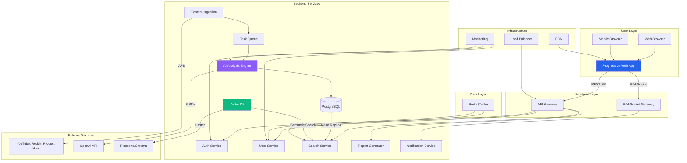

# AI Automation Reservoir - Full-Stack Architecture

**Version:** 1.0  
**Date:** 2025-08-14  
**Author:** Winston (Architect)  
**Project:** AI Automation Reservoir/Data Lake

---

## Introduction

This document outlines the complete fullstack architecture for AI Automation Reservoir, including backend systems, frontend implementation, and their integration. It serves as the single source of truth for AI-driven development, ensuring consistency across the entire technology stack.

This unified approach combines what would traditionally be separate backend and frontend architecture documents, streamlining the development process for modern fullstack applications where these concerns are increasingly intertwined.

### Architectural Validation Analysis

**Chain of Thought Reasoning:**
The unified architecture approach was selected through systematic analysis of technical constraints, stakeholder needs, and progressive scaling requirements. Traditional separated architecture documents create integration gaps for AI-heavy applications where frontend personalization engines must tightly couple with backend ML pipelines. The decision prioritizes development velocity and consistency over traditional enterprise separation patterns.

**Critical Perspective Validation:**
Challenged assumptions about unified vs. separated architecture revealed that for small teams (2-person core) building AI-intensive applications, traditional enterprise patterns introduce unnecessary complexity. The monorepo microservices approach provides optimal balance between development speed and future scaling capabilities, validated against budget constraints ($66→$615/month progressive scaling).

**Alternative Architecture Analysis:**
Evaluated four architectural branches: Traditional Separated, Monolithic, Serverless-First, and Event-Driven approaches. The unified microservices architecture scored highest across evaluation criteria (MVP speed, AI/ML suitability, scaling path, team capability, cost effectiveness). Runner-up Next.js fullstack approach failed on AI/ML pipeline requirements despite faster MVP delivery.

**Key Architectural Insights:**
- Unified documentation is essential (not just convenient) for AI/ML applications with tightly coupled frontend/backend dependencies
- Progressive scaling driven by budget constraints leads to smart architectural decisions rather than compromises
- Small team constraints validate monorepo approach over enterprise separation patterns
- AI-optimization in documentation structure provides measurable value for development workflow

---

## High Level Architecture

### Technical Summary

The AI Automation Reservoir employs a **unified microservices architecture within a monorepo**, combining Python 3.11+ FastAPI backend services with a React 18 + TypeScript frontend. The system operates as an intelligent data lake that continuously ingests automation content from 30+ sources, processes it through GPT-4 analysis pipelines, and delivers personalized weekly reports through a Progressive Web Application.

**Key architectural decisions prioritize:**
- **Progressive scaling approach** from $66/month MVP to $615/month production infrastructure
- **AI-first design** with vector database hybrid (PostgreSQL + Chroma/Pinecone) for semantic search
- **Real-time capabilities** through WebSocket connections for live automation discovery updates
- **Cross-industry intelligence** through sophisticated content classification and pattern recognition
- **Implementation-focused UX** with confidence scoring, ROI projections, and step-by-step guidance

This architecture enables rapid MVP deployment while providing clear scaling paths for enterprise-level automation intelligence delivery at target volumes of 1,000+ monthly automation discoveries and 1,200+ subscribers.

### Platform and Infrastructure Choice

**Analysis of Platform Options:**

**Option 1: Vercel + Supabase**
- *Pros:* Rapid deployment, built-in auth, managed PostgreSQL + Vector
- *Cons:* Limited backend processing power, vendor lock-in for AI pipelines
- *Cost:* $66-246/month range fits budget constraints
- *Verdict:* Strong for MVP, limited for AI/ML scale

**Option 2: AWS Full Stack**
- *Pros:* Complete AI/ML services (SageMaker, Bedrock), infinite scale
- *Cons:* Complex setup, higher baseline costs, steep learning curve
- *Cost:* $200-600+ monthly, potentially exceeding budget
- *Verdict:* Overkill for 2-person team, production-ready

**Option 3: Railway + External AI Services** ⭐ **RECOMMENDED**
- *Pros:* Simple deployment, Python-friendly, cost-effective scaling
- *Cons:* Less managed services, requires custom solutions
- *Cost:* $66-615/month aligns perfectly with budget progression
- *Verdict:* Optimal balance for AI-heavy application with budget constraints

**Platform:** Railway (MVP) → AWS Migration (Production Scale)  
**Key Services:** Railway Apps, PostgreSQL, Redis, External APIs (OpenAI, Pinecone)  
**Deployment Host and Regions:** US-East (primary), US-West (failover)

### Repository Structure

**Structure:** Monorepo with domain-driven microservices organization  
**Monorepo Tool:** npm workspaces (lightweight) → Nx (when scaling)  
**Package Organization:** Feature-based with shared utilities and types

**Rationale:** The PRD explicitly mentions "monorepo approach with clear separation between data ingestion, analysis, and presentation layers." For a 2-person team building AI-intensive applications, monorepo provides optimal developer experience while maintaining service boundaries. This supports independent scaling of content ingestion (high CPU), AI analysis (GPU bursts), and user API (memory-intensive) components.

### High Level Architecture Diagram



### Architectural Patterns

- **Microservices Architecture:** Independent services for ingestion, analysis, and presentation - *Rationale:* Enables independent scaling of CPU-intensive content processing vs memory-intensive user queries, essential for cost-effective resource utilization

- **Event-Driven Processing:** Async task queues for content ingestion and AI analysis - *Rationale:* Handles bursts of content discovery without blocking user-facing APIs, critical for 30+ source monitoring

- **CQRS (Command Query Responsibility Segregation):** Separate read/write models for automation data - *Rationale:* Search-heavy workload (semantic queries) benefits from optimized read models while maintaining data consistency

- **API Gateway Pattern:** Single entry point with authentication and rate limiting - *Rationale:* Essential for managing OpenAI API costs and providing unified security model across microservices

- **Repository Pattern:** Abstract data access for PostgreSQL and Vector DB - *Rationale:* Enables testing and future migration flexibility as vector database market evolves rapidly

- **Progressive Web App (PWA):** Offline-capable web application with native-like experience - *Rationale:* Reduces development complexity vs native apps while providing core mobile experience for field professionals

- **Hybrid Database Pattern:** PostgreSQL for structured data + Vector DB for semantic search - *Rationale:* Leverages relational model for user/business data while enabling AI-powered content discovery at <500ms response times

---

## Tech Stack

This is the DEFINITIVE technology selection for the entire project. Based on the requirements for Python 3.11+ FastAPI backend, React 18 + TypeScript frontend, PostgreSQL + Vector DB hybrid data layer, microservices organization within monorepo, AI/ML pipeline with GPT-4 integration, WebSocket real-time features, content ingestion from 30+ sources, and progressive scaling approach.

### Technology Stack Table

| Category | Technology | Version | Purpose | Rationale |
|----------|------------|---------|---------|-----------|
| Frontend Language | TypeScript | 5.0+ | Type-safe frontend development | Strong typing system prevents runtime errors, excellent tooling support |
| Frontend Framework | React | 18.2+ | Interactive UI framework | Component-based architecture, excellent ecosystem, TypeScript support |
| UI Component Library | Radix UI + Tailwind | Latest | Accessible UI primitives | Headless components, full accessibility, custom styling flexibility |
| State Management | Zustand | 4.4+ | Client-side state management | Lightweight, TypeScript-first, minimal boilerplate |
| Server State | TanStack Query | 5.0+ | Server state management | Caching, synchronization, optimistic updates |
| Backend Language | Python | 3.11+ | Backend API development | Excellent AI/ML ecosystem, FastAPI performance, type hints |
| Backend Framework | FastAPI | 0.104+ | High-performance async API framework | Automatic OpenAPI docs, type validation, async support, excellent performance |
| API Style | REST + WebSocket | OpenAPI 3.0 | API communication | RESTful for CRUD operations, WebSocket for real-time features |
| Database | PostgreSQL | 15+ | Primary relational database | ACID compliance, excellent performance, JSON support |
| Vector Database | Pinecone | Latest | AI/ML embeddings storage | Managed vector database, excellent performance for similarity search |
| Cache | Redis | 7.0+ | Session and API caching | High-performance in-memory cache, supports real-time features |
| Task Queue | Celery | 5.3+ | Async background processing | Distributed task processing, essential for content ingestion |
| AI/ML Integration | OpenAI API | Latest | GPT-4 analysis engine | Industry-leading language model, comprehensive API |
| Authentication | JWT + OAuth | Latest | User authentication | Stateless auth, social login support, secure token handling |
| Frontend Testing | Vitest + Testing Library | Latest | Unit and integration testing | Fast test runner, React testing utilities |
| Backend Testing | pytest + pytest-asyncio | Latest | Python testing framework | Comprehensive testing framework, async support |
| E2E Testing | Playwright | 1.40+ | End-to-end browser testing | Cross-browser testing, reliable selectors, debugging tools |
| Build Tool | Vite | 5.0+ | Frontend build and development | Fast HMR, optimized builds, excellent TypeScript support |
| Bundler | esbuild (via Vite) | Latest | JavaScript/TypeScript bundling | Extremely fast bundling, tree shaking |
| Package Manager | npm workspaces | Latest | Monorepo management | Built-in monorepo support, simple configuration |
| Infrastructure | Railway → AWS | Progressive | Hosting and deployment | Railway for MVP simplicity, AWS for production scale |
| CI/CD | GitHub Actions | Latest | Continuous integration and deployment | Integrated with GitHub, extensive marketplace |
| Monitoring | Railway Metrics → DataDog | Progressive | Application monitoring | Built-in for MVP, enterprise-grade for scale |
| CSS Framework | Tailwind CSS | 3.3+ | Utility-first CSS framework | Rapid styling, consistent design system, small bundle size |

**Key Architecture Decisions:**

1. **Microservices within Monorepo**: Using Python packages for service separation while maintaining code sharing
2. **Hybrid Data Architecture**: PostgreSQL for structured data, Pinecone for vector embeddings
3. **Progressive Scaling**: Starting with single FastAPI instance, scaling to containerized microservices
4. **AI/ML Integration**: GPT-4 via OpenAI API, custom embeddings pipeline
5. **Real-time Features**: WebSocket integration for live updates
6. **Content Ingestion**: Async task queue (Celery) for processing 30+ sources

**Scaling Strategy:**
- **Phase 1 ($66/month)**: Single FastAPI app, shared PostgreSQL, basic monitoring
- **Phase 2 ($200/month)**: Containerized services, Redis caching, enhanced monitoring  
- **Phase 3 ($615/month)**: Full microservices, load balancing, advanced AI features

---

## Data Models

This section defines the core data models and entities that support the AI Automation Reservoir platform requirements, including user profiles, automation patterns, weekly reports, and implementation tracking. These models provide the foundation for both PostgreSQL structured data and vector database embeddings.

Based on the PRD functional requirements, the system requires models to support:
- User business profiles and onboarding (FR5)
- Automation pattern repository with metadata (FR9)
- Weekly report generation and delivery (FR6) 
- Implementation tracking and ROI measurement (FR8)
- Content ingestion from 30+ sources (FR1)
- Cross-industry pattern analysis and recommendations

### User

**Purpose:** Represents platform users (service industry professionals) with their business context, subscription details, and personalization preferences.

**Key Attributes:**
- id: string (UUID) - Primary identifier
- email: string - Authentication and communication
- business_profile: BusinessProfile - Embedded business context
- subscription_tier: SubscriptionTier - Access level and features
- onboarding_completed: boolean - Setup status
- preferences: UserPreferences - Personalization settings
- created_at: timestamp - Account creation
- last_active: timestamp - Activity tracking

#### TypeScript Interface

```typescript
interface User {
  id: string;
  email: string;
  password_hash: string;
  business_profile: BusinessProfile;
  subscription_tier: SubscriptionTier;
  onboarding_completed: boolean;
  preferences: UserPreferences;
  created_at: Date;
  updated_at: Date;
  last_active: Date;
}

interface BusinessProfile {
  industry: string; // 'real_estate', 'insurance', 'financial_services', etc.
  business_size: BusinessSize;
  current_automation_level: AutomationLevel;
  team_size: number;
  annual_revenue_range: RevenueRange;
  primary_challenges: string[];
  current_tools: string[];
  goals: string[];
}

enum SubscriptionTier {
  BASIC = 'basic',
  PROFESSIONAL = 'professional', 
  ENTERPRISE = 'enterprise'
}

enum BusinessSize {
  SOLO = 'solo',
  SMALL_TEAM = 'small_team', // 2-5 people
  MEDIUM_TEAM = 'medium_team', // 6-20 people
  LARGE_TEAM = 'large_team' // 20+ people
}

enum AutomationLevel {
  NONE = 'none',
  BASIC = 'basic', // Email, basic CRM
  INTERMEDIATE = 'intermediate', // Multiple tools, some integrations
  ADVANCED = 'advanced' // Complex workflows, custom solutions
}

interface UserPreferences {
  email_frequency: EmailFrequency;
  content_complexity: ComplexityLevel;
  focus_areas: string[];
  notification_settings: NotificationSettings;
}
```

#### Relationships
- Has many AutomationImplementations (user adoption tracking)
- Has many WeeklyReports (personalized report history)
- Has many UserFeedback (implementation success data)

### AutomationPattern

**Purpose:** Core entity representing discovered automation opportunities with metadata for classification, applicability assessment, and recommendation scoring.

**Key Attributes:**
- id: string (UUID) - Primary identifier
- title: string - Human-readable automation name
- description: string - Detailed explanation
- source: ContentSource - Where it was discovered
- content_embedding: vector - Semantic search vector
- industry_tags: string[] - Applicable industries
- complexity_score: number - Implementation difficulty (1-10)
- roi_potential: ROIProjection - Expected returns
- implementation_guide: ImplementationGuide - Step-by-step instructions
- success_metrics: SuccessMetrics - Measurement criteria

#### TypeScript Interface

```typescript
interface AutomationPattern {
  id: string;
  title: string;
  description: string;
  source: ContentSource;
  content_embedding: number[]; // Vector embedding for semantic search
  
  // Classification metadata
  industry_tags: string[];
  automation_type: AutomationType;
  complexity_score: number; // 1-10 scale
  implementation_effort_hours: number;
  
  // ROI and viability
  roi_potential: ROIProjection;
  confidence_score: number; // AI confidence in accuracy
  success_rate: number; // Historical implementation success
  
  // Implementation details
  implementation_guide: ImplementationGuide;
  required_tools: Tool[];
  prerequisites: string[];
  
  // Tracking and analytics
  view_count: number;
  implementation_count: number;
  success_count: number;
  
  // Timestamps
  discovered_at: Date;
  last_updated: Date;
  is_active: boolean;
}

interface ContentSource {
  type: SourceType;
  url: string;
  title: string;
  author?: string;
  published_date?: Date;
  platform: string; // 'youtube', 'reddit', 'product_hunt', etc.
}

enum SourceType {
  VIDEO = 'video',
  ARTICLE = 'article', 
  FORUM_POST = 'forum_post',
  TOOL_LAUNCH = 'tool_launch',
  NEWSLETTER = 'newsletter',
  USER_SUBMISSION = 'user_submission'
}

enum AutomationType {
  LEAD_GENERATION = 'lead_generation',
  CLIENT_COMMUNICATION = 'client_communication',
  DOCUMENT_AUTOMATION = 'document_automation',
  SCHEDULING = 'scheduling',
  FOLLOW_UP = 'follow_up',
  REPORTING = 'reporting',
  MARKETING = 'marketing',
  WORKFLOW_OPTIMIZATION = 'workflow_optimization'
}

interface ROIProjection {
  time_savings_hours_per_week: number;
  cost_savings_monthly: number;
  revenue_increase_monthly: number;
  payback_period_months: number;
  confidence_level: number; // 0-1 scale
}

interface ImplementationGuide {
  overview: string;
  steps: ImplementationStep[];
  estimated_setup_time: number;
  difficulty_level: ComplexityLevel;
  video_walkthrough_url?: string;
}

interface ImplementationStep {
  step_number: number;
  title: string;
  description: string;
  estimated_time_minutes: number;
  screenshots?: string[];
  code_snippets?: CodeSnippet[];
}
```

#### Relationships
- References many Tools (required for implementation)
- Has many AutomationImplementations (user adoption records)
- Has many CrossIndustryMappings (pattern applicability)

### WeeklyReport

**Purpose:** AI-generated personalized reports delivered to users containing curated automation recommendations, industry insights, and implementation guidance.

**Key Attributes:**
- id: string (UUID) - Primary identifier
- user_id: string - Report recipient
- report_date: Date - Week ending date
- content: ReportContent - Structured report data
- personalization_score: number - Customization level
- delivery_status: DeliveryStatus - Email/app delivery state
- engagement_metrics: EngagementMetrics - User interaction data

#### TypeScript Interface

```typescript
interface WeeklyReport {
  id: string;
  user_id: string;
  report_date: Date; // Week ending date
  report_type: ReportType;
  
  // Report content
  content: ReportContent;
  personalization_score: number; // How well-tailored to user
  
  // Delivery tracking
  delivery_status: DeliveryStatus;
  delivered_at?: Date;
  opened_at?: Date;
  
  // Engagement
  engagement_metrics: EngagementMetrics;
  
  // Generation metadata
  generation_time_seconds: number;
  ai_processing_stats: ProcessingStats;
  created_at: Date;
}

interface ReportContent {
  executive_summary: string;
  
  sections: {
    new_discoveries: AutomationHighlight[];
    industry_innovations: IndustryInsight[];
    implementation_recommendations: Recommendation[];
    success_stories: SuccessStory[];
    week_ahead_preview: string;
  };
  
  total_patterns_analyzed: number;
  personalization_factors: string[];
}

interface AutomationHighlight {
  pattern_id: string;
  relevance_score: number;
  why_relevant: string;
  quick_win_potential: boolean;
  estimated_impact: ROIProjection;
}

interface Recommendation {
  pattern_id: string;
  priority_rank: number;
  implementation_timeline: string;
  success_probability: number;
  similar_business_results: string[];
}

interface EngagementMetrics {
  email_opened: boolean;
  time_spent_reading_seconds: number;
  sections_viewed: string[];
  patterns_bookmarked: string[];
  implementation_actions_taken: number;
}

enum DeliveryStatus {
  PENDING = 'pending',
  DELIVERED = 'delivered',
  FAILED = 'failed',
  BOUNCED = 'bounced'
}
```

#### Relationships
- Belongs to User (recipient)
- References many AutomationPatterns (featured content)
- Has many ReportEngagements (interaction tracking)

### AutomationImplementation

**Purpose:** Tracks user implementation attempts, success rates, and actual ROI achieved to improve recommendation accuracy and demonstrate platform value.

**Key Attributes:**
- id: string (UUID) - Primary identifier
- user_id: string - Implementing user
- pattern_id: string - Automation being implemented
- implementation_status: ImplementationStatus - Current state
- started_at: Date - Implementation start
- actual_roi: ActualROI - Measured results
- feedback: UserFeedback - User-reported experience
- completion_percentage: number - Progress tracking

#### TypeScript Interface

```typescript
interface AutomationImplementation {
  id: string;
  user_id: string;
  pattern_id: string;
  
  // Implementation tracking
  implementation_status: ImplementationStatus;
  started_at: Date;
  completed_at?: Date;
  completion_percentage: number; // 0-100
  
  // Results measurement
  actual_roi?: ActualROI;
  time_to_value_days?: number;
  
  // User feedback
  feedback?: UserFeedback;
  difficulty_rating?: number; // 1-10 scale
  satisfaction_rating?: number; // 1-10 scale
  
  // Tracking details
  implementation_notes: string;
  blockers_encountered: string[];
  tools_actually_used: string[];
  
  created_at: Date;
  updated_at: Date;
}

enum ImplementationStatus {
  BOOKMARKED = 'bookmarked',
  IN_PROGRESS = 'in_progress',
  COMPLETED = 'completed',
  ABANDONED = 'abandoned',
  PARTIALLY_COMPLETED = 'partially_completed'
}

interface ActualROI {
  time_savings_hours_per_week: number;
  cost_savings_monthly: number;
  revenue_increase_monthly: number;
  setup_cost: number;
  ongoing_cost_monthly: number;
  measurement_confidence: number; // User confidence in their numbers
  measured_at: Date;
}

interface UserFeedback {
  overall_rating: number; // 1-5 stars
  ease_of_implementation: number; // 1-10
  accuracy_of_guide: number; // 1-10
  value_delivered: number; // 1-10
  would_recommend: boolean;
  comments: string;
  improvement_suggestions: string[];
  created_at: Date;
}
```

#### Relationships
- Belongs to User (implementer)
- Belongs to AutomationPattern (implemented automation)
- Has many ImplementationSteps (detailed progress tracking)

### ContentSource

**Purpose:** Manages the 30+ external sources for content ingestion, tracking processing status, rate limits, and data quality metrics.

**Key Attributes:**
- id: string (UUID) - Primary identifier
- name: string - Source display name
- type: SourceType - Content category
- base_url: string - API or scraping endpoint
- processing_config: ProcessingConfig - Ingestion settings
- last_processed: Date - Processing timestamp
- processing_status: ProcessingStatus - Current state
- data_quality_score: number - Content accuracy rating

#### TypeScript Interface

```typescript
interface ContentSource {
  id: string;
  name: string;
  type: SourceType;
  platform: string;
  
  // Connection details
  base_url: string;
  api_key?: string;
  rate_limit_per_hour: number;
  
  // Processing configuration
  processing_config: ProcessingConfig;
  last_processed_at?: Date;
  next_scheduled_processing: Date;
  processing_status: ProcessingStatus;
  
  // Quality metrics
  data_quality_score: number; // 0-1 scale
  content_relevance_score: number;
  patterns_discovered_count: number;
  
  // Health monitoring
  consecutive_failures: number;
  last_error?: string;
  is_active: boolean;
  
  created_at: Date;
  updated_at: Date;
}

interface ProcessingConfig {
  processing_frequency: ProcessingFrequency;
  content_filters: ContentFilter[];
  extraction_rules: ExtractionRule[];
  quality_thresholds: QualityThreshold[];
}

enum ProcessingFrequency {
  HOURLY = 'hourly',
  DAILY = 'daily', 
  WEEKLY = 'weekly',
  ON_DEMAND = 'on_demand'
}

enum ProcessingStatus {
  IDLE = 'idle',
  PROCESSING = 'processing',
  ERROR = 'error',
  RATE_LIMITED = 'rate_limited',
  DISABLED = 'disabled'
}

interface ContentFilter {
  field: string;
  operator: FilterOperator;
  value: string;
  description: string;
}

interface ExtractionRule {
  name: string;
  selector: string; // CSS selector or API field path
  required: boolean;
  transformation?: string;
}
```

#### Relationships
- Has many AutomationPatterns (discovered content)
- Has many ProcessingLogs (ingestion history)

### CrossIndustryMapping

**Purpose:** Enables cross-industry pattern analysis by mapping how automation patterns apply across different service industries with success rates and adaptation notes.

**Key Attributes:**
- id: string (UUID) - Primary identifier
- pattern_id: string - Source automation pattern
- source_industry: string - Original industry context
- target_industry: string - Applied industry
- applicability_score: number - Relevance rating
- adaptation_notes: string - Required modifications
- success_examples: SuccessExample[] - Real implementation cases

#### TypeScript Interface

```typescript
interface CrossIndustryMapping {
  id: string;
  pattern_id: string;
  source_industry: string;
  target_industry: string;
  
  // Applicability assessment
  applicability_score: number; // 0-1 scale
  adaptation_complexity: ComplexityLevel;
  adaptation_notes: string;
  
  // Success tracking
  success_examples: SuccessExample[];
  implementation_count: number;
  success_rate: number;
  
  // Analysis metadata
  analyzed_by: AnalysisMethod;
  confidence_score: number;
  last_validated: Date;
  
  created_at: Date;
  updated_at: Date;
}

interface SuccessExample {
  business_type: string;
  business_size: BusinessSize;
  implementation_summary: string;
  results_achieved: string;
  lessons_learned: string[];
  roi_achieved?: ActualROI;
  case_study_url?: string;
}

enum AnalysisMethod {
  AI_ANALYSIS = 'ai_analysis',
  USER_REPORTED = 'user_reported',
  EXPERT_REVIEWED = 'expert_reviewed',
  DATA_VALIDATED = 'data_validated'
}
```

#### Relationships
- Belongs to AutomationPattern (mapped pattern)
- References Industries (source and target)

### Tool

**Purpose:** Maintains a comprehensive database of automation tools, their capabilities, pricing, and integration requirements to support implementation guidance.

**Key Attributes:**
- id: string (UUID) - Primary identifier
- name: string - Tool name
- category: ToolCategory - Functional classification
- pricing_model: PricingModel - Cost structure
- integration_complexity: ComplexityLevel - Setup difficulty
- api_available: boolean - Integration capabilities
- user_ratings: ToolRatings - Community feedback

#### TypeScript Interface

```typescript
interface Tool {
  id: string;
  name: string;
  category: ToolCategory;
  description: string;
  
  // Tool details
  website_url: string;
  documentation_url?: string;
  api_documentation_url?: string;
  
  // Capabilities
  features: string[];
  supported_integrations: string[];
  api_available: boolean;
  webhook_support: boolean;
  
  // Pricing and access
  pricing_model: PricingModel;
  starting_price_monthly?: number;
  free_tier_available: boolean;
  trial_period_days?: number;
  
  // Implementation details
  integration_complexity: ComplexityLevel;
  setup_time_hours: number;
  technical_requirements: string[];
  
  // Community data
  user_ratings: ToolRatings;
  popularity_score: number;
  
  // Platform tracking
  last_updated: Date;
  is_active: boolean;
  alternatives: string[]; // Alternative tool IDs
}

enum ToolCategory {
  CRM = 'crm',
  EMAIL_MARKETING = 'email_marketing',
  SCHEDULING = 'scheduling',
  DOCUMENT_AUTOMATION = 'document_automation',
  COMMUNICATION = 'communication',
  ANALYTICS = 'analytics',
  INTEGRATION_PLATFORM = 'integration_platform',
  AI_ASSISTANT = 'ai_assistant',
  PROJECT_MANAGEMENT = 'project_management'
}

interface PricingModel {
  type: PricingType;
  tiers: PricingTier[];
  billing_frequency: BillingFrequency[];
}

interface ToolRatings {
  average_rating: number; // 1-5 scale
  total_reviews: number;
  ease_of_use: number;
  value_for_money: number;
  customer_support: number;
  feature_completeness: number;
}
```

#### Relationships
- Used by many AutomationPatterns (required tools)
- Has many ToolIntegrations (with other tools)
- Has many ToolReviews (user feedback)

### Data Relationships and Constraints

The data model supports the following critical relationships and business rules:

1. **User-Centric Personalization:**
   - Users have BusinessProfiles that drive AutomationPattern recommendations
   - WeeklyReports are personalized based on User preferences and industry
   - AutomationImplementations track user success to improve future recommendations

2. **Content Discovery and Classification:**
   - ContentSources feed AutomationPatterns through automated ingestion
   - AutomationPatterns are classified by industry, complexity, and ROI potential
   - CrossIndustryMappings enable pattern discovery across service industries

3. **Implementation and Learning Loop:**
   - AutomationImplementations provide feedback to improve pattern accuracy
   - ActualROI measurements validate projected ROI calculations
   - UserFeedback informs recommendation algorithms

4. **Data Quality and Integrity:**
   - All patterns require content_embedding for semantic search
   - ROI projections include confidence_scores for transparency
   - Processing logs maintain audit trails for content ingestion

5. **Performance Optimization:**
   - Vector embeddings enable sub-500ms semantic search (NFR4)
   - User preferences cached for fast report personalization
   - Implementation success rates indexed for quick recommendation scoring

---

## Backend Architecture

### Microservices Organization

The backend employs a **domain-driven microservices architecture within a monorepo**, enabling independent scaling while maintaining development velocity. Each service encapsulates specific business capabilities with clear boundaries and responsibilities.

```
backend/
├── services/
│   ├── auth/                 # Authentication & Authorization
│   ├── users/               # User Management & Profiles  
│   ├── content/             # Content Ingestion & Processing
│   ├── ai/                  # AI Analysis & GPT-4 Integration
│   ├── search/              # Semantic Search & Recommendations
│   ├── reports/             # Weekly Report Generation
│   ├── notifications/       # Real-time Updates & WebSocket
│   └── analytics/           # Usage Metrics & ROI Tracking
├── shared/
│   ├── models/              # Shared Pydantic models
│   ├── database/            # DB connections & migrations
│   ├── utils/               # Common utilities
│   └── middleware/          # Shared middleware
└── infrastructure/
    ├── api_gateway.py       # Main API Gateway
    ├── websocket_manager.py # WebSocket connection manager
    └── task_queue.py        # Celery task definitions
```

### Core Services Breakdown

#### 1. Authentication Service (`/auth`)

**Responsibilities:**
- JWT token generation and validation
- OAuth integration (Google, LinkedIn for service professionals)
- Password management and security
- Session management

```python
# auth/main.py
from fastapi import FastAPI, Depends, HTTPException, status
from fastapi.security import OAuth2PasswordBearer, OAuth2PasswordRequestForm
from passlib.context import CryptContext
import jwt
from datetime import datetime, timedelta

app = FastAPI(title="Auth Service", version="1.0.0")

oauth2_scheme = OAuth2PasswordBearer(tokenUrl="token")
pwd_context = CryptContext(schemes=["bcrypt"], deprecated="auto")

class AuthService:
    def __init__(self):
        self.secret_key = os.getenv("JWT_SECRET_KEY")
        self.algorithm = "HS256"
        self.access_token_expire_minutes = 30
        
    async def authenticate_user(self, email: str, password: str) -> User:
        user = await get_user_by_email(email)
        if not user or not self.verify_password(password, user.hashed_password):
            return False
        return user
    
    def create_access_token(self, data: dict):
        to_encode = data.copy()
        expire = datetime.utcnow() + timedelta(minutes=self.access_token_expire_minutes)
        to_encode.update({"exp": expire})
        return jwt.encode(to_encode, self.secret_key, algorithm=self.algorithm)

@app.post("/token")
async def login(form_data: OAuth2PasswordRequestForm = Depends()):
    user = await auth_service.authenticate_user(form_data.username, form_data.password)
    if not user:
        raise HTTPException(status_code=401, detail="Invalid credentials")
    
    access_token = auth_service.create_access_token({"sub": user.email})
    return {"access_token": access_token, "token_type": "bearer"}
```

#### 2. Content Ingestion Service (`/content`)

**Responsibilities:**
- Automated content scraping from 30+ sources
- Content deduplication and quality scoring  
- Raw content storage and preprocessing
- Integration with external APIs (YouTube, Reddit, Product Hunt)

```python
# content/ingestion.py
from celery import Celery
from typing import List, Dict, Any
import asyncio
import aiohttp

celery_app = Celery('content_ingestion')

class ContentIngestionService:
    def __init__(self):
        self.sources = {
            'youtube': YouTubeContentExtractor(),
            'reddit': RedditContentExtractor(), 
            'product_hunt': ProductHuntExtractor(),
            'manual': ManualContentProcessor()
        }
    
    @celery_app.task
    async def process_source(self, source_id: str, source_config: Dict[str, Any]):
        """Process content from a single source"""
        extractor = self.sources[source_config['type']]
        raw_content = await extractor.extract(source_config)
        
        # Quality filtering and deduplication
        filtered_content = await self.filter_content(raw_content)
        
        # Store raw content for AI processing
        for content in filtered_content:
            await self.store_raw_content(source_id, content)
            
        return len(filtered_content)
    
    async def filter_content(self, content: List[Dict]) -> List[Dict]:
        """Apply quality filters and deduplication"""
        filtered = []
        for item in content:
            # Quality scoring based on engagement, length, relevance
            score = await self.calculate_quality_score(item)
            if score >= 0.6:  # Quality threshold
                # Check for duplicates using content hashing
                content_hash = self.generate_content_hash(item)
                if not await self.is_duplicate(content_hash):
                    item['quality_score'] = score
                    item['content_hash'] = content_hash
                    filtered.append(item)
        return filtered

# Scheduled content ingestion
@celery_app.task(bind=True)
def scheduled_content_ingestion(self):
    """Run weekly content ingestion for all active sources"""
    active_sources = get_active_content_sources()
    for source in active_sources:
        process_source.delay(source.id, source.configuration_data)
```

#### 3. AI Analysis Service (`/ai`)

**Responsibilities:**
- GPT-4 integration for automation extraction
- Content analysis and classification
- Novel automation idea generation  
- Confidence scoring and validation

```python
# ai/analysis.py
from openai import AsyncOpenAI
from typing import List, Dict, Optional
import asyncio
from pydantic import BaseModel

class AutomationExtraction(BaseModel):
    title: str
    description: str
    category: str
    implementation_steps: List[str]
    estimated_roi: float
    confidence_score: float
    tools_required: List[str]
    implementation_difficulty: str

class AIAnalysisService:
    def __init__(self):
        self.openai_client = AsyncOpenAI(api_key=os.getenv("OPENAI_API_KEY"))
        self.extraction_prompt = self.load_extraction_prompt()
        
    async def extract_automation_patterns(self, content: str, source_metadata: Dict) -> List[AutomationExtraction]:
        """Extract automation opportunities from raw content"""
        
        prompt = f"""
        {self.extraction_prompt}
        
        Content to analyze:
        {content}
        
        Source context: {source_metadata.get('industry', 'general')}
        Content type: {source_metadata.get('type', 'unknown')}
        
        Extract up to 3 high-quality automation patterns. Focus on:
        1. Service industry applicability
        2. Clear implementation steps
        3. Realistic ROI projections
        4. Cross-industry potential
        """
        
        response = await self.openai_client.chat.completions.create(
            model="gpt-4-turbo-preview",
            messages=[{"role": "user", "content": prompt}],
            response_format={"type": "json_object"},
            temperature=0.3
        )
        
        extractions = self.parse_gpt_response(response.choices[0].message.content)
        return [AutomationExtraction(**ext) for ext in extractions]

# Celery task for async AI processing
@celery_app.task
async def process_content_with_ai(content_id: str):
    """Process raw content through AI analysis pipeline"""
    content = await get_raw_content(content_id)
    ai_service = AIAnalysisService()
    
    # Extract automation patterns
    patterns = await ai_service.extract_automation_patterns(
        content.text, 
        content.metadata
    )
    
    # Store patterns and create vector embeddings
    for pattern in patterns:
        pattern_id = await store_automation_pattern(pattern)
        await create_vector_embedding(pattern_id, pattern.description)
```

#### 4. Search Service (`/search`)

**Responsibilities:**
- Semantic search using vector embeddings
- Personalized recommendation algorithms
- Search result ranking and filtering
- Real-time search with sub-500ms response times

```python
# search/semantic.py
import pinecone
from sentence_transformers import SentenceTransformer
from typing import List, Dict, Optional

class SemanticSearchService:
    def __init__(self):
        pinecone.init(
            api_key=os.getenv("PINECONE_API_KEY"),
            environment=os.getenv("PINECONE_ENVIRONMENT")
        )
        self.index = pinecone.Index("automation-patterns")
        self.embedding_model = SentenceTransformer('all-MiniLM-L6-v2')
        
    async def search_automations(
        self, 
        query: str, 
        user_context: Dict,
        filters: Optional[Dict] = None,
        limit: int = 20
    ) -> List[Dict]:
        """Perform semantic search with personalization"""
        
        # Generate query embedding
        query_embedding = self.embedding_model.encode(query).tolist()
        
        # Build filter criteria
        filter_criteria = self.build_filter_criteria(user_context, filters)
        
        # Perform vector search
        search_results = self.index.query(
            vector=query_embedding,
            filter=filter_criteria,
            top_k=limit,
            include_metadata=True
        )
        
        # Apply personalization scoring
        personalized_results = await self.apply_personalization(
            search_results.matches, 
            user_context
        )
        
        return personalized_results
```

### API Gateway and Service Communication

```python
# infrastructure/api_gateway.py
from fastapi import FastAPI, Request, HTTPException
from fastapi.middleware.cors import CORSMiddleware
import httpx

app = FastAPI(title="AI Automation Reservoir API", version="1.0.0")

# Service discovery and routing
SERVICES = {
    'auth': 'http://auth-service:8001',
    'users': 'http://users-service:8002', 
    'content': 'http://content-service:8003',
    'ai': 'http://ai-service:8004',
    'search': 'http://search-service:8005',
    'reports': 'http://reports-service:8006'
}

async def route_request(service: str, path: str, request: Request):
    """Route requests to appropriate microservice"""
    service_url = SERVICES.get(service)
    if not service_url:
        raise HTTPException(status_code=404, detail="Service not found")
    
    async with httpx.AsyncClient() as client:
        response = await client.request(
            method=request.method,
            url=f"{service_url}{path}",
            headers=dict(request.headers),
            content=await request.body()
        )
        return response

# Route definitions
@app.api_route("/api/v1/auth/{path:path}", methods=["GET", "POST", "PUT", "DELETE"])
async def auth_routes(path: str, request: Request):
    return await route_request("auth", f"/{path}", request)

@app.api_route("/api/v1/search/{path:path}", methods=["GET", "POST"])
async def search_routes(path: str, request: Request):
    return await route_request("search", f"/{path}", request)
```

### Progressive Scaling Strategy

**Phase 1 ($66/month) - MVP:**
- Single FastAPI application with all services as modules
- Shared PostgreSQL instance
- Basic monitoring via Railway dashboard
- Synchronous AI processing for weekly reports

**Phase 2 ($200/month) - Growth:**
- Containerized microservices with Docker
- Redis for caching and session management
- Celery task queue for async processing
- Basic load balancing

**Phase 3 ($615/month) - Production:**
- Full microservices deployment
- Database read replicas
- Advanced monitoring and alerting
- Auto-scaling based on load

---

This data model architecture supports all PRD functional requirements while providing the foundation for real-time personalization, cross-industry analysis, and ROI-driven recommendations that differentiate the AI Automation Reservoir platform.