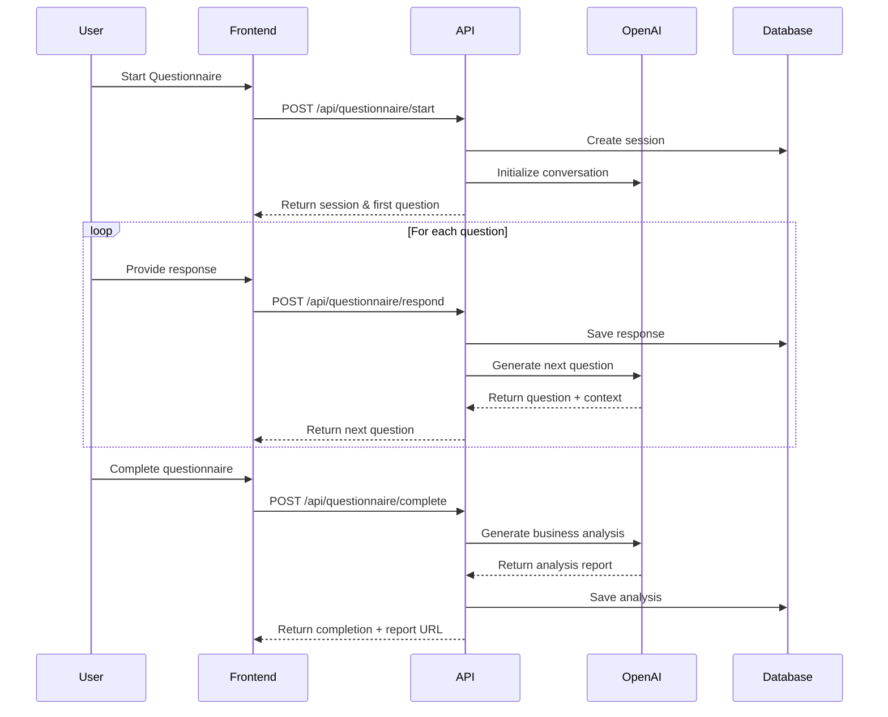
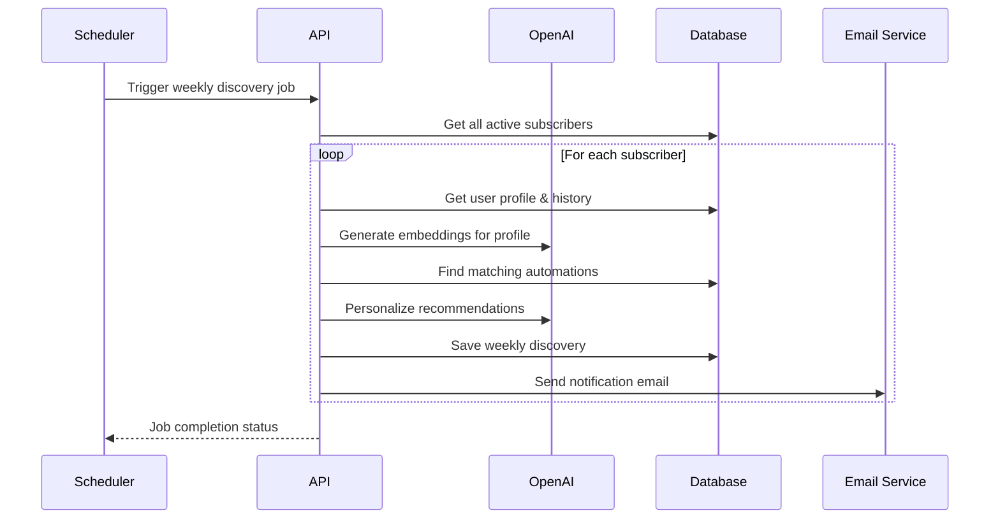

# Reservoir Platform - Full-Stack Architecture
## Technical Architecture Specification v1.0

**Project:** Reservoir MVP - AI-Powered Automation Discovery Platform  
**Author:** Winston (Architect)  
**Date:** August 17, 2025  
**Version:** 1.0  

---

## 1. Introduction

### Project Overview
Reservoir is an AI-powered automation discovery platform designed specifically for real estate professionals. The platform combines an intelligent questionnaire system that delivers consultant-grade business analysis with a subscription-based "Reservoir" that provides weekly personalized automation recommendations.

### Architecture Goals
- **Scalability:** Handle 100+ concurrent users with sub-3-second response times
- **Cost Efficiency:** Optimize OpenAI API costs under $500/month for 500 users
- **Developer Velocity:** Monolithic Next.js architecture for rapid MVP development
- **User Experience:** Mobile-first PWA with 85+ Lighthouse scores
- **AI Integration:** Seamless OpenAI integration with fallback strategies

---

## 2. High Level Architecture

### Technical Summary
**Architecture Pattern:** Monolithic Next.js 14 application with modular service layers  
**Platform Choice:** Web-first Progressive Web Application (PWA)  
**Repository Structure:** Single monorepo containing frontend, backend, and shared utilities  
**Deployment Model:** Serverless edge deployment via Netlify  

### Core System Components
```
┌─────────────────────────────────────────────────────────┐
│                    Client Layer                         │
│  ┌─────────────┐ ┌─────────────┐ ┌─────────────────────┐│
│  │   Mobile    │ │   Tablet    │ │      Desktop        ││
│  │    PWA      │ │    PWA      │ │       PWA           ││
│  └─────────────┘ └─────────────┘ └─────────────────────┘│
└─────────────────────────────────────────────────────────┘
                           │
┌─────────────────────────────────────────────────────────┐
│                 Next.js 14 Application                  │
│  ┌─────────────┐ ┌─────────────┐ ┌─────────────────────┐│
│  │  Frontend   │ │ API Routes  │ │   Middleware        ││
│  │ Components  │ │   Layer     │ │     Layer           ││
│  └─────────────┘ └─────────────┘ └─────────────────────┘│
└─────────────────────────────────────────────────────────┘
                           │
┌─────────────────────────────────────────────────────────┐
│                  Service Layer                          │
│  ┌─────────────┐ ┌─────────────┐ ┌─────────────────────┐│
│  │   AI & ML   │ │    Auth     │ │    Business         ││
│  │  Services   │ │  Services   │ │    Services         ││
│  └─────────────┘ └─────────────┘ └─────────────────────┘│
└─────────────────────────────────────────────────────────┘
                           │
┌─────────────────────────────────────────────────────────┐
│                 External Services                       │
│  ┌─────────────┐ ┌─────────────┐ ┌─────────────────────┐│
│  │  Supabase   │ │   OpenAI    │ │      Stripe         ││
│  │   (DB)      │ │    API      │ │    (Payments)       ││
│  └─────────────┘ └─────────────┘ └─────────────────────┘│
└─────────────────────────────────────────────────────────┘
```

---

## 3. Tech Stack

| Category | Technology | Version | Purpose |
|----------|------------|---------|---------|
| **Frontend Framework** | Next.js | 14.x | Full-stack React framework |
| **Language** | TypeScript | 5.x | Type-safe development |
| **Styling** | Tailwind CSS | 3.x | Utility-first CSS framework |
| **UI Components** | shadcn/ui | Latest | Accessible component library |
| **State Management** | React Context + Zustand | Latest | Global + local state |
| **Database** | PostgreSQL (Supabase) | 15.x | Primary data store |
| **Authentication** | Supabase Auth | Latest | User authentication |
| **AI/ML** | OpenAI API | v1 | GPT-4 Turbo + Assistants API |
| **Embeddings** | OpenAI Ada-2 | Latest | Semantic matching |
| **Payments** | Stripe | Latest | Subscription management |
| **Email** | Resend API | Latest | Transactional emails |
| **Hosting** | Netlify Pro | Latest | Edge deployment |
| **Monitoring** | Sentry | Latest | Error tracking |
| **Analytics** | Vercel Analytics | Latest | Performance monitoring |
| **Testing** | Jest + RTL | Latest | Unit/integration testing |

---

## 4. Data Models

### Core Business Entities

```typescript
// User Management
interface User {
  id: string;
  email: string;
  firstName: string;
  lastName: string;
  role: 'user' | 'admin';
  subscriptionStatus: 'free' | 'trial' | 'active' | 'cancelled';
  subscriptionId?: string;
  createdAt: Date;
  updatedAt: Date;
}

interface UserProfile {
  id: string;
  userId: string;
  businessSize: 'solo' | 'small-team' | 'large-team';
  industry: string;
  experience: 'beginner' | 'intermediate' | 'expert';
  currentTools: string[];
  painPoints: string[];
  goals: string[];
  completedQuestionnaire: boolean;
  questionnaireScore?: number;
  createdAt: Date;
  updatedAt: Date;
}

// Questionnaire System
interface QuestionnaireSession {
  id: string;
  userId: string;
  status: 'in_progress' | 'completed' | 'abandoned';
  currentQuestionIndex: number;
  totalQuestions: number;
  responses: QuestionnaireResponse[];
  businessAnalysis?: string;
  completedAt?: Date;
  createdAt: Date;
  updatedAt: Date;
}

interface QuestionnaireResponse {
  id: string;
  sessionId: string;
  questionText: string;
  responseText: string;
  questionCategory: string;
  aiContext?: any;
  timestamp: Date;
}

// Automation Library
interface Automation {
  id: string;
  title: string;
  description: string;
  category: string;
  difficulty: 'easy' | 'medium' | 'hard';
  timeSaved: number; // hours per week
  revenueImpact: number; // dollars per month
  implementationTime: number; // hours
  tags: string[];
  requiredTools: AutomationTool[];
  steps: ImplementationStep[];
  targetAudience: {
    businessSize: string[];
    experience: string[];
    industries: string[];
  };
  published: boolean;
  embedding?: number[]; // OpenAI embedding vector
  createdAt: Date;
  updatedAt: Date;
}

interface ImplementationStep {
  id: string;
  automationId: string;
  order: number;
  title: string;
  instructions: string;
  estimatedTime: string;
  requiredTools: string[];
  media: StepMedia[];
}

interface StepMedia {
  id: string;
  stepId: string;
  type: 'image' | 'video';
  url: string;
  alt: string;
  caption?: string;
}

// Discovery & Recommendations
interface WeeklyDiscovery {
  id: string;
  userId: string;
  weekOf: Date;
  automations: DiscoveredAutomation[];
  personalizedMessage?: string;
  viewed: boolean;
  viewedAt?: Date;
  createdAt: Date;
}

interface DiscoveredAutomation {
  id: string;
  discoveryId: string;
  automationId: string;
  relevanceScore: number;
  personalizedReason: string;
  status: 'new' | 'saved' | 'dismissed' | 'implemented';
  statusChangedAt?: Date;
}

// User Progress Tracking
interface UserAutomation {
  id: string;
  userId: string;
  automationId: string;
  status: 'saved' | 'in_progress' | 'completed' | 'dismissed';
  progress: AutomationProgress[];
  actualTimeSaved?: number;
  actualRevenueImpact?: number;
  feedback?: string;
  rating?: number;
  startedAt?: Date;
  completedAt?: Date;
  createdAt: Date;
  updatedAt: Date;
}

interface AutomationProgress {
  id: string;
  userAutomationId: string;
  stepId: string;
  completed: boolean;
  notes?: string;
  completedAt?: Date;
}

// Subscription Management
interface Subscription {
  id: string;
  userId: string;
  stripeSubscriptionId: string;
  status: 'trialing' | 'active' | 'past_due' | 'canceled' | 'unpaid';
  planId: string;
  currentPeriodStart: Date;
  currentPeriodEnd: Date;
  cancelAtPeriodEnd: boolean;
  createdAt: Date;
  updatedAt: Date;
}
```

---

## 5. API Specification

### REST API Architecture

**Base URL:** `/api/v1`  
**Authentication:** Bearer tokens via Supabase Auth  
**Response Format:** JSON with consistent error handling  

#### Core Endpoints

```typescript
// Authentication
POST   /api/auth/signup
POST   /api/auth/signin
POST   /api/auth/signout
GET    /api/auth/me

// Questionnaire
POST   /api/questionnaire/start
GET    /api/questionnaire/session/:id
POST   /api/questionnaire/respond
POST   /api/questionnaire/complete
GET    /api/questionnaire/report/:sessionId

// Discoveries
GET    /api/discoveries/weekly
GET    /api/discoveries/browse
POST   /api/discoveries/save
POST   /api/discoveries/dismiss
GET    /api/discoveries/saved

// Automations
GET    /api/automations
GET    /api/automations/:id
POST   /api/automations/:id/implement
PUT    /api/automations/:id/progress
GET    /api/automations/my-implementations

// User & Profile
GET    /api/user/profile
PUT    /api/user/profile
GET    /api/user/analytics
GET    /api/user/subscription

// Admin (Protected)
GET    /api/admin/automations
POST   /api/admin/automations
PUT    /api/admin/automations/:id
DELETE /api/admin/automations/:id
GET    /api/admin/analytics
```

#### API Response Format

```typescript
interface ApiResponse<T> {
  success: boolean;
  data?: T;
  error?: {
    code: string;
    message: string;
    details?: any;
  };
  meta?: {
    pagination?: {
      page: number;
      limit: number;
      total: number;
      totalPages: number;
    };
  };
}
```

---

## 6. External API Integrations

### OpenAI Integration

```typescript
// AI Service Configuration
interface OpenAIConfig {
  apiKey: string;
  model: 'gpt-4-turbo' | 'gpt-3.5-turbo';
  maxTokens: number;
  temperature: number;
  rateLimits: {
    requestsPerMinute: number;
    tokensPerMinute: number;
  };
}

// Questionnaire AI Service
class QuestionnaireAI {
  async generateNextQuestion(context: QuestionContext): Promise<Question> {
    // Use OpenAI Assistants API for conversation flow
  }
  
  async analyzeResponses(responses: QuestionnaireResponse[]): Promise<BusinessAnalysis> {
    // Generate comprehensive business analysis
  }
  
  async extractStructuredData(responses: QuestionnaireResponse[]): Promise<UserProfile> {
    // Extract structured business profile data
  }
}

// Personalization Engine
class PersonalizationEngine {
  async generateEmbeddings(content: string): Promise<number[]> {
    // Use OpenAI Ada-2 for semantic embeddings
  }
  
  async findSimilarAutomations(userProfile: UserProfile): Promise<ScoredAutomation[]> {
    // Semantic matching using embeddings
  }
  
  async personalizeRecommendations(automations: Automation[], userProfile: UserProfile): Promise<PersonalizedRecommendation[]> {
    // Generate personalized messaging
  }
}
```

### Supabase Integration

```typescript
// Database Service
class DatabaseService {
  private supabase: SupabaseClient;
  
  // User Management
  async createUser(userData: Partial<User>): Promise<User> {}
  async getUserProfile(userId: string): Promise<UserProfile> {}
  async updateUserProfile(userId: string, updates: Partial<UserProfile>): Promise<UserProfile> {}
  
  // Questionnaire
  async createQuestionnaireSession(userId: string): Promise<QuestionnaireSession> {}
  async saveQuestionnaireResponse(response: QuestionnaireResponse): Promise<void> {}
  async getQuestionnaireSession(sessionId: string): Promise<QuestionnaireSession> {}
  
  // Automations
  async getAutomations(filters?: AutomationFilters): Promise<Automation[]> {}
  async saveUserAutomation(userAutomation: UserAutomation): Promise<void> {}
  async getUserAutomations(userId: string): Promise<UserAutomation[]> {}
}
```

### Stripe Integration

```typescript
// Payment Service
class PaymentService {
  async createSubscription(userId: string, priceId: string): Promise<Subscription> {}
  async cancelSubscription(subscriptionId: string): Promise<void> {}
  async handleWebhook(event: Stripe.Event): Promise<void> {}
  async getCustomerPortalUrl(customerId: string): Promise<string> {}
}
```

---

## 7. Core Workflows

### Questionnaire Flow



### Weekly Discovery Generation



---

## 8. Database Schema

### PostgreSQL Schema (Supabase)

```sql
-- Users and Authentication (handled by Supabase Auth)
CREATE TABLE user_profiles (
  id UUID PRIMARY KEY DEFAULT gen_random_uuid(),
  user_id UUID REFERENCES auth.users(id) ON DELETE CASCADE,
  business_size TEXT CHECK (business_size IN ('solo', 'small-team', 'large-team')),
  industry TEXT,
  experience TEXT CHECK (experience IN ('beginner', 'intermediate', 'expert')),
  current_tools TEXT[],
  pain_points TEXT[],
  goals TEXT[],
  completed_questionnaire BOOLEAN DEFAULT FALSE,
  questionnaire_score NUMERIC,
  created_at TIMESTAMPTZ DEFAULT NOW(),
  updated_at TIMESTAMPTZ DEFAULT NOW()
);

-- Questionnaire System
CREATE TABLE questionnaire_sessions (
  id UUID PRIMARY KEY DEFAULT gen_random_uuid(),
  user_id UUID REFERENCES auth.users(id) ON DELETE CASCADE,
  status TEXT CHECK (status IN ('in_progress', 'completed', 'abandoned')) DEFAULT 'in_progress',
  current_question_index INTEGER DEFAULT 0,
  total_questions INTEGER,
  business_analysis TEXT,
  completed_at TIMESTAMPTZ,
  created_at TIMESTAMPTZ DEFAULT NOW(),
  updated_at TIMESTAMPTZ DEFAULT NOW()
);

CREATE TABLE questionnaire_responses (
  id UUID PRIMARY KEY DEFAULT gen_random_uuid(),
  session_id UUID REFERENCES questionnaire_sessions(id) ON DELETE CASCADE,
  question_text TEXT NOT NULL,
  response_text TEXT NOT NULL,
  question_category TEXT,
  ai_context JSONB,
  timestamp TIMESTAMPTZ DEFAULT NOW()
);

-- Automation Library
CREATE TABLE automations (
  id UUID PRIMARY KEY DEFAULT gen_random_uuid(),
  title TEXT NOT NULL,
  description TEXT NOT NULL,
  category TEXT NOT NULL,
  difficulty TEXT CHECK (difficulty IN ('easy', 'medium', 'hard')),
  time_saved INTEGER, -- hours per week
  revenue_impact INTEGER, -- dollars per month
  implementation_time INTEGER, -- hours
  tags TEXT[],
  target_business_size TEXT[],
  target_experience TEXT[],
  target_industries TEXT[],
  published BOOLEAN DEFAULT FALSE,
  embedding VECTOR(1536), -- OpenAI Ada-2 embedding
  created_at TIMESTAMPTZ DEFAULT NOW(),
  updated_at TIMESTAMPTZ DEFAULT NOW()
);

CREATE TABLE automation_tools (
  id UUID PRIMARY KEY DEFAULT gen_random_uuid(),
  automation_id UUID REFERENCES automations(id) ON DELETE CASCADE,
  tool_name TEXT NOT NULL,
  tool_category TEXT,
  required BOOLEAN DEFAULT TRUE,
  signup_url TEXT
);

CREATE TABLE implementation_steps (
  id UUID PRIMARY KEY DEFAULT gen_random_uuid(),
  automation_id UUID REFERENCES automations(id) ON DELETE CASCADE,
  order_index INTEGER NOT NULL,
  title TEXT NOT NULL,
  instructions TEXT NOT NULL,
  estimated_time TEXT,
  required_tools TEXT[]
);

CREATE TABLE step_media (
  id UUID PRIMARY KEY DEFAULT gen_random_uuid(),
  step_id UUID REFERENCES implementation_steps(id) ON DELETE CASCADE,
  type TEXT CHECK (type IN ('image', 'video')),
  url TEXT NOT NULL,
  alt TEXT,
  caption TEXT
);

-- Discovery and Recommendations
CREATE TABLE weekly_discoveries (
  id UUID PRIMARY KEY DEFAULT gen_random_uuid(),
  user_id UUID REFERENCES auth.users(id) ON DELETE CASCADE,
  week_of DATE NOT NULL,
  personalized_message TEXT,
  viewed BOOLEAN DEFAULT FALSE,
  viewed_at TIMESTAMPTZ,
  created_at TIMESTAMPTZ DEFAULT NOW()
);

CREATE TABLE discovered_automations (
  id UUID PRIMARY KEY DEFAULT gen_random_uuid(),
  discovery_id UUID REFERENCES weekly_discoveries(id) ON DELETE CASCADE,
  automation_id UUID REFERENCES automations(id),
  relevance_score NUMERIC(3,2),
  personalized_reason TEXT,
  status TEXT CHECK (status IN ('new', 'saved', 'dismissed', 'implemented')) DEFAULT 'new',
  status_changed_at TIMESTAMPTZ
);

-- User Progress Tracking
CREATE TABLE user_automations (
  id UUID PRIMARY KEY DEFAULT gen_random_uuid(),
  user_id UUID REFERENCES auth.users(id) ON DELETE CASCADE,
  automation_id UUID REFERENCES automations(id),
  status TEXT CHECK (status IN ('saved', 'in_progress', 'completed', 'dismissed')),
  actual_time_saved INTEGER,
  actual_revenue_impact INTEGER,
  feedback TEXT,
  rating INTEGER CHECK (rating >= 1 AND rating <= 5),
  started_at TIMESTAMPTZ,
  completed_at TIMESTAMPTZ,
  created_at TIMESTAMPTZ DEFAULT NOW(),
  updated_at TIMESTAMPTZ DEFAULT NOW()
);

CREATE TABLE automation_progress (
  id UUID PRIMARY KEY DEFAULT gen_random_uuid(),
  user_automation_id UUID REFERENCES user_automations(id) ON DELETE CASCADE,
  step_id UUID REFERENCES implementation_steps(id),
  completed BOOLEAN DEFAULT FALSE,
  notes TEXT,
  completed_at TIMESTAMPTZ
);

-- Subscription Management
CREATE TABLE subscriptions (
  id UUID PRIMARY KEY DEFAULT gen_random_uuid(),
  user_id UUID REFERENCES auth.users(id) ON DELETE CASCADE,
  stripe_subscription_id TEXT UNIQUE,
  stripe_customer_id TEXT,
  status TEXT CHECK (status IN ('trialing', 'active', 'past_due', 'canceled', 'unpaid')),
  plan_id TEXT,
  current_period_start TIMESTAMPTZ,
  current_period_end TIMESTAMPTZ,
  cancel_at_period_end BOOLEAN DEFAULT FALSE,
  created_at TIMESTAMPTZ DEFAULT NOW(),
  updated_at TIMESTAMPTZ DEFAULT NOW()
);

-- Indexes for Performance
CREATE INDEX idx_user_profiles_user_id ON user_profiles(user_id);
CREATE INDEX idx_questionnaire_sessions_user_id ON questionnaire_sessions(user_id);
CREATE INDEX idx_questionnaire_responses_session_id ON questionnaire_responses(session_id);
CREATE INDEX idx_automations_category ON automations(category);
CREATE INDEX idx_automations_published ON automations(published);
CREATE INDEX idx_weekly_discoveries_user_id ON weekly_discoveries(user_id);
CREATE INDEX idx_weekly_discoveries_week_of ON weekly_discoveries(week_of);
CREATE INDEX idx_user_automations_user_id ON user_automations(user_id);
CREATE INDEX idx_user_automations_status ON user_automations(status);

-- Row Level Security (RLS)
ALTER TABLE user_profiles ENABLE ROW LEVEL SECURITY;
ALTER TABLE questionnaire_sessions ENABLE ROW LEVEL SECURITY;
ALTER TABLE questionnaire_responses ENABLE ROW LEVEL SECURITY;
ALTER TABLE weekly_discoveries ENABLE ROW LEVEL SECURITY;
ALTER TABLE discovered_automations ENABLE ROW LEVEL SECURITY;
ALTER TABLE user_automations ENABLE ROW LEVEL SECURITY;
ALTER TABLE automation_progress ENABLE ROW LEVEL SECURITY;
ALTER TABLE subscriptions ENABLE ROW LEVEL SECURITY;

-- RLS Policies (Users can only access their own data)
CREATE POLICY "Users can view own profile" ON user_profiles
  FOR SELECT USING (auth.uid() = user_id);

CREATE POLICY "Users can update own profile" ON user_profiles
  FOR UPDATE USING (auth.uid() = user_id);

-- Similar policies for other user-specific tables...
```

---

## 9. Frontend Architecture

### Component Organization

```
src/
├── components/
│   ├── ui/                    # shadcn/ui components
│   │   ├── button.tsx
│   │   ├── card.tsx
│   │   ├── input.tsx
│   │   └── ...
│   ├── forms/                 # Form components
│   │   ├── QuestionnaireForm.tsx
│   │   ├── ProfileForm.tsx
│   │   └── ...
│   ├── discovery/             # Discovery-related components
│   │   ├── DiscoveryCard.tsx
│   │   ├── DiscoveryFeed.tsx
│   │   ├── FilterBar.tsx
│   │   └── ...
│   ├── automation/            # Automation components
│   │   ├── AutomationDetail.tsx
│   │   ├── ImplementationGuide.tsx
│   │   ├── ProgressTracker.tsx
│   │   └── ...
│   ├── analytics/             # Analytics components
│   │   ├── MetricsCard.tsx
│   │   ├── TrendChart.tsx
│   │   ├── ROIDashboard.tsx
│   │   └── ...
│   └── layout/                # Layout components
│       ├── Header.tsx
│       ├── Navigation.tsx
│       ├── Footer.tsx
│       └── ...
├── pages/
│   ├── index.tsx              # Landing page
│   ├── questionnaire/
│   │   └── index.tsx          # Questionnaire interface
│   ├── dashboard/
│   │   └── index.tsx          # Main dashboard
│   ├── discoveries/
│   │   ├── index.tsx          # Discovery feed
│   │   └── [id].tsx           # Individual automation
│   ├── progress/
│   │   └── index.tsx          # User progress
│   ├── admin/
│   │   ├── index.tsx          # Admin dashboard
│   │   └── automations/       # Admin automation management
│   └── api/                   # API routes
├── lib/
│   ├── services/              # Service layer
│   │   ├── api.ts             # API client
│   │   ├── ai.ts              # OpenAI integration
│   │   ├── auth.ts            # Authentication
│   │   ├── database.ts        # Database operations
│   │   └── payments.ts        # Stripe integration
│   ├── hooks/                 # Custom React hooks
│   │   ├── useAuth.ts
│   │   ├── useDiscoveries.ts
│   │   ├── useQuestionnaire.ts
│   │   └── ...
│   ├── utils/                 # Utility functions
│   │   ├── date.ts
│   │   ├── formatting.ts
│   │   ├── validation.ts
│   │   └── ...
│   └── types/                 # TypeScript types
│       ├── api.ts
│       ├── automation.ts
│       ├── user.ts
│       └── ...
├── stores/                    # Zustand stores
│   ├── authStore.ts
│   ├── discoveryStore.ts
│   ├── questionnaireStore.ts
│   └── ...
└── styles/
    ├── globals.css
    └── components.css
```

### State Management Strategy

```typescript
// Global State (React Context)
interface AppContextType {
  user: User | null;
  subscription: Subscription | null;
  theme: 'light' | 'dark';
  notifications: Notification[];
}

// Local State (Zustand)
interface DiscoveryStore {
  discoveries: WeeklyDiscovery[];
  filters: DiscoveryFilters;
  loading: boolean;
  error: string | null;
  
  // Actions
  setDiscoveries: (discoveries: WeeklyDiscovery[]) => void;
  updateFilters: (filters: Partial<DiscoveryFilters>) => void;
  saveAutomation: (automationId: string) => Promise<void>;
  dismissAutomation: (automationId: string) => Promise<void>;
}

interface QuestionnaireStore {
  session: QuestionnaireSession | null;
  currentQuestion: Question | null;
  responses: QuestionnaireResponse[];
  loading: boolean;
  
  // Actions
  startSession: () => Promise<void>;
  submitResponse: (response: string) => Promise<void>;
  completeQuestionnaire: () => Promise<void>;
}
```

---

## 10. Backend Architecture

### Service Layer Organization

```typescript
// Core Services
export class AuthService {
  constructor(private supabase: SupabaseClient) {}
  
  async signUp(email: string, password: string): Promise<AuthResult> {}
  async signIn(email: string, password: string): Promise<AuthResult> {}
  async signOut(): Promise<void> {}
  async getCurrentUser(): Promise<User | null> {}
  async refreshSession(): Promise<AuthResult> {}
}

export class QuestionnaireService {
  constructor(
    private database: DatabaseService,
    private ai: OpenAIService
  ) {}
  
  async startSession(userId: string): Promise<QuestionnaireSession> {}
  async processResponse(sessionId: string, response: string): Promise<Question> {}
  async generateAnalysis(sessionId: string): Promise<BusinessAnalysis> {}
}

export class DiscoveryService {
  constructor(
    private database: DatabaseService,
    private ai: OpenAIService
  ) {}
  
  async generateWeeklyDiscoveries(userId: string): Promise<WeeklyDiscovery> {}
  async getPersonalizedAutomations(userProfile: UserProfile): Promise<Automation[]> {}
  async calculateRelevanceScore(automation: Automation, profile: UserProfile): Promise<number> {}
}

export class AutomationService {
  constructor(private database: DatabaseService) {}
  
  async getAutomations(filters?: AutomationFilters): Promise<Automation[]> {}
  async getAutomationById(id: string): Promise<Automation | null> {}
  async saveUserAutomation(userId: string, automationId: string): Promise<void> {}
  async updateProgress(userAutomationId: string, stepId: string, completed: boolean): Promise<void> {}
}

export class AnalyticsService {
  constructor(private database: DatabaseService) {}
  
  async getUserMetrics(userId: string): Promise<UserMetrics> {}
  async calculateROI(userId: string): Promise<ROIMetrics> {}
  async getTopPerformingAutomations(userId: string): Promise<AutomationPerformance[]> {}
}
```

### API Route Structure

```typescript
// pages/api/auth/[...supabase].ts
export default function handler(req: NextApiRequest, res: NextApiResponse) {
  return createPagesServerClient({ req, res }).auth.api.createSupabaseServerApiHandler();
}

// pages/api/questionnaire/start.ts
export default async function handler(req: NextApiRequest, res: NextApiResponse) {
  const { user } = await getUser(req, res);
  if (!user) return res.status(401).json({ error: 'Unauthorized' });
  
  const questionnaireService = new QuestionnaireService(database, openai);
  const session = await questionnaireService.startSession(user.id);
  
  return res.json({ success: true, data: session });
}

// pages/api/discoveries/weekly.ts
export default async function handler(req: NextApiRequest, res: NextApiResponse) {
  const { user } = await getUser(req, res);
  if (!user) return res.status(401).json({ error: 'Unauthorized' });
  
  const discoveryService = new DiscoveryService(database, openai);
  const discoveries = await discoveryService.getWeeklyDiscoveries(user.id);
  
  return res.json({ success: true, data: discoveries });
}
```

---

## 11. Security Architecture

### Authentication & Authorization

```typescript
// Middleware for protected routes
export function withAuth(handler: NextApiHandler): NextApiHandler {
  return async (req: NextApiRequest, res: NextApiResponse) => {
    try {
      const supabase = createPagesServerClient({ req, res });
      const { data: { user }, error } = await supabase.auth.getUser();
      
      if (error || !user) {
        return res.status(401).json({ error: 'Unauthorized' });
      }
      
      req.user = user;
      return handler(req, res);
    } catch (error) {
      return res.status(401).json({ error: 'Authentication failed' });
    }
  };
}

// Admin role checking
export function withAdminAuth(handler: NextApiHandler): NextApiHandler {
  return withAuth(async (req: NextApiRequest, res: NextApiResponse) => {
    const userProfile = await database.getUserProfile(req.user.id);
    
    if (userProfile.role !== 'admin') {
      return res.status(403).json({ error: 'Insufficient permissions' });
    }
    
    return handler(req, res);
  });
}
```

### Data Protection

```typescript
// Input validation and sanitization
export const validateQuestionnaireResponse = z.object({
  sessionId: z.string().uuid(),
  response: z.string().min(1).max(500),
  questionId: z.string().uuid()
});

// Rate limiting
export function withRateLimit(
  limit: number,
  window: number,
  keyGenerator?: (req: NextApiRequest) => string
) {
  return (handler: NextApiHandler): NextApiHandler => {
    return async (req: NextApiRequest, res: NextApiResponse) => {
      const key = keyGenerator ? keyGenerator(req) : req.ip;
      const isAllowed = await checkRateLimit(key, limit, window);
      
      if (!isAllowed) {
        return res.status(429).json({ error: 'Rate limit exceeded' });
      }
      
      return handler(req, res);
    };
  };
}

// OpenAI API cost controls
export class OpenAICostManager {
  private static readonly MAX_MONTHLY_SPEND = 500; // $500
  private static readonly MAX_DAILY_SPEND = 20; // $20
  
  async checkSpendingLimits(userId: string, estimatedCost: number): Promise<boolean> {
    const dailySpend = await this.getDailySpend();
    const monthlySpend = await this.getMonthlySpend();
    
    return (
      dailySpend + estimatedCost <= OpenAICostManager.MAX_DAILY_SPEND &&
      monthlySpend + estimatedCost <= OpenAICostManager.MAX_MONTHLY_SPEND
    );
  }
}
```

---

## 12. Performance Optimization

### Caching Strategy

```typescript
// Redis caching for expensive operations
export class CacheService {
  private redis: Redis;
  
  // Cache user profiles for 1 hour
  async getUserProfile(userId: string): Promise<UserProfile | null> {
    const cached = await this.redis.get(`profile:${userId}`);
    if (cached) return JSON.parse(cached);
    
    const profile = await database.getUserProfile(userId);
    await this.redis.setex(`profile:${userId}`, 3600, JSON.stringify(profile));
    return profile;
  }
  
  // Cache automation embeddings indefinitely
  async getAutomationEmbedding(automationId: string): Promise<number[] | null> {
    const cached = await this.redis.get(`embedding:${automationId}`);
    if (cached) return JSON.parse(cached);
    
    const automation = await database.getAutomation(automationId);
    if (automation.embedding) {
      await this.redis.set(`embedding:${automationId}`, JSON.stringify(automation.embedding));
      return automation.embedding;
    }
    
    return null;
  }
}

// Database query optimization
export class OptimizedQueries {
  // Batch load user automations with implementation steps
  async getUserAutomationsWithSteps(userId: string): Promise<UserAutomationWithSteps[]> {
    return database.query(`
      SELECT 
        ua.*,
        a.title, a.description, a.category,
        json_agg(
          json_build_object(
            'id', is.id,
            'title', is.title,
            'order_index', is.order_index,
            'completed', ap.completed
          ) ORDER BY is.order_index
        ) as steps
      FROM user_automations ua
      JOIN automations a ON ua.automation_id = a.id
      LEFT JOIN implementation_steps is ON a.id = is.automation_id
      LEFT JOIN automation_progress ap ON is.id = ap.step_id AND ua.id = ap.user_automation_id
      WHERE ua.user_id = $1
      GROUP BY ua.id, a.id
    `, [userId]);
  }
}
```

### AI Response Optimization

```typescript
export class OptimizedAIService {
  // Batch embeddings generation
  async generateBatchEmbeddings(texts: string[]): Promise<number[][]> {
    const response = await openai.embeddings.create({
      model: 'text-embedding-ada-002',
      input: texts
    });
    
    return response.data.map(item => item.embedding);
  }
  
  // Streaming questionnaire responses
  async streamQuestionnaireResponse(context: QuestionContext): Promise<ReadableStream> {
    const stream = await openai.chat.completions.create({
      model: 'gpt-4-turbo',
      messages: context.messages,
      stream: true,
      max_tokens: 150
    });
    
    return new ReadableStream({
      async start(controller) {
        for await (const chunk of stream) {
          const content = chunk.choices[0]?.delta?.content;
          if (content) {
            controller.enqueue(new TextEncoder().encode(content));
          }
        }
        controller.close();
      }
    });
  }
  
  // Smart caching for similar questions
  async getCachedResponse(questionSignature: string): Promise<string | null> {
    return await cache.get(`ai_response:${questionSignature}`);
  }
  
  async setCachedResponse(questionSignature: string, response: string): Promise<void> {
    await cache.setex(`ai_response:${questionSignature}`, 86400, response); // 24 hours
  }
}
```

---

## 13. Testing Strategy

### Testing Pyramid

```typescript
// Unit Tests (70%)
describe('AutomationService', () => {
  let service: AutomationService;
  let mockDatabase: jest.Mocked<DatabaseService>;
  
  beforeEach(() => {
    mockDatabase = createMockDatabase();
    service = new AutomationService(mockDatabase);
  });
  
  it('should filter automations by category', async () => {
    const automations = await service.getAutomations({ category: 'lead-management' });
    expect(automations).toHaveLength(3);
    expect(automations.every(a => a.category === 'lead-management')).toBe(true);
  });
});

// Integration Tests (20%)
describe('Questionnaire API', () => {
  it('should complete full questionnaire flow', async () => {
    const { req, res } = createMocks({
      method: 'POST',
      body: { response: 'I am a listing agent' }
    });
    
    await startQuestionnaireHandler(req, res);
    expect(res._getStatusCode()).toBe(200);
    
    const session = JSON.parse(res._getData()).data;
    expect(session.status).toBe('in_progress');
  });
});

// E2E Tests (10%)
describe('User Journey', () => {
  it('should complete questionnaire and receive recommendations', async () => {
    await page.goto('/questionnaire');
    await page.click('text=Start Free Analysis');
    
    // Complete questionnaire flow
    for (let i = 0; i < 10; i++) {
      await page.fill('[placeholder="Type your response..."]', `Response ${i}`);
      await page.click('[aria-label="Send message"]');
      await page.waitForSelector('.ai-message');
    }
    
    // Verify report generation
    await expect(page.locator('.analysis-report')).toBeVisible();
    await expect(page.locator('text=Your Automation Score')).toBeVisible();
  });
});
```

### AI Testing Strategy

```typescript
// Mock AI responses for testing
export class MockAIService implements AIService {
  private responses: Map<string, string> = new Map([
    ['initial_question', 'Welcome! Let\'s start by understanding your role...'],
    ['follow_up_business_size', 'Great! How many agents work in your office?'],
    ['analysis_completion', 'Based on your responses, here\'s your business analysis...']
  ]);
  
  async generateNextQuestion(context: QuestionContext): Promise<Question> {
    const key = this.getResponseKey(context);
    const text = this.responses.get(key) || 'Default question';
    
    return {
      id: `q_${Date.now()}`,
      text,
      category: 'general',
      expectedResponseType: 'text'
    };
  }
  
  async generateBusinessAnalysis(responses: QuestionnaireResponse[]): Promise<string> {
    return 'Mock business analysis based on responses';
  }
}

// AI response validation
export function validateAIResponse(response: string): boolean {
  return (
    response.length > 10 &&
    response.length < 500 &&
    !response.includes('I cannot') &&
    !response.includes('I\'m sorry')
  );
}
```

---

## 14. Error Handling & Monitoring

### Unified Error Handling

```typescript
// Error types
export enum ErrorCode {
  AUTHENTICATION_FAILED = 'AUTH_001',
  INSUFFICIENT_PERMISSIONS = 'AUTH_002',
  RESOURCE_NOT_FOUND = 'RESOURCE_001',
  VALIDATION_ERROR = 'VALIDATION_001',
  AI_SERVICE_ERROR = 'AI_001',
  DATABASE_ERROR = 'DB_001',
  RATE_LIMIT_EXCEEDED = 'RATE_001',
  SUBSCRIPTION_REQUIRED = 'SUB_001'
}

export class AppError extends Error {
  constructor(
    public code: ErrorCode,
    message: string,
    public statusCode: number = 500,
    public details?: any
  ) {
    super(message);
    this.name = 'AppError';
  }
}

// Global error handler
export function handleApiError(error: Error, req: NextApiRequest, res: NextApiResponse) {
  // Log error to Sentry
  Sentry.captureException(error, {
    tags: {
      endpoint: req.url,
      method: req.method,
      userId: req.user?.id
    }
  });
  
  if (error instanceof AppError) {
    return res.status(error.statusCode).json({
      success: false,
      error: {
        code: error.code,
        message: error.message,
        details: error.details
      }
    });
  }
  
  // Don't expose internal errors
  return res.status(500).json({
    success: false,
    error: {
      code: ErrorCode.DATABASE_ERROR,
      message: 'Internal server error'
    }
  });
}

// AI service error handling
export class AIServiceErrorHandler {
  static async handleOpenAIError(error: any): Promise<never> {
    if (error.status === 429) {
      throw new AppError(
        ErrorCode.RATE_LIMIT_EXCEEDED,
        'AI service rate limit exceeded. Please try again later.',
        429
      );
    }
    
    if (error.status === 400) {
      throw new AppError(
        ErrorCode.AI_SERVICE_ERROR,
        'Invalid request to AI service',
        400
      );
    }
    
    throw new AppError(
      ErrorCode.AI_SERVICE_ERROR,
      'AI service temporarily unavailable',
      503
    );
  }
}
```

### Monitoring & Observability

```typescript
// Performance monitoring
export class PerformanceMonitor {
  static async trackAPICall<T>(
    operation: string,
    fn: () => Promise<T>
  ): Promise<T> {
    const start = Date.now();
    
    try {
      const result = await fn();
      
      // Track success metrics
      this.recordMetric(`${operation}.duration`, Date.now() - start);
      this.recordMetric(`${operation}.success`, 1);
      
      return result;
    } catch (error) {
      // Track error metrics
      this.recordMetric(`${operation}.duration`, Date.now() - start);
      this.recordMetric(`${operation}.error`, 1);
      
      throw error;
    }
  }
  
  private static recordMetric(name: string, value: number) {
    // Send to monitoring service (e.g., DataDog, CloudWatch)
  }
}

// Usage tracking
export class UsageTracker {
  static async trackQuestionnaireProgress(userId: string, questionIndex: number) {
    await analytics.track({
      userId,
      event: 'Questionnaire Progress',
      properties: {
        questionIndex,
        timestamp: new Date().toISOString()
      }
    });
  }
  
  static async trackAutomationSaved(userId: string, automationId: string) {
    await analytics.track({
      userId,
      event: 'Automation Saved',
      properties: {
        automationId,
        timestamp: new Date().toISOString()
      }
    });
  }
}
```

---

## 15. Deployment Architecture

### Netlify Configuration

```toml
# netlify.toml
[build]
  command = "npm run build"
  publish = ".next"

[build.environment]
  NODE_VERSION = "18"
  NPM_VERSION = "9"

[[plugins]]
  package = "@netlify/plugin-nextjs"

[functions]
  node_bundler = "esbuild"

[[redirects]]
  from = "/api/*"
  to = "/.netlify/functions/:splat"
  status = 200

[[headers]]
  for = "/*"
  [headers.values]
    X-Frame-Options = "DENY"
    X-Content-Type-Options = "nosniff"
    Referrer-Policy = "strict-origin-when-cross-origin"
    Permissions-Policy = "camera=(), microphone=(), geolocation=()"

# Environment-specific configurations
[context.production.environment]
  NEXT_PUBLIC_SUPABASE_URL = "https://your-project.supabase.co"
  NEXT_PUBLIC_SUPABASE_ANON_KEY = "your-anon-key"
  OPENAI_API_KEY = "your-openai-key"
  STRIPE_SECRET_KEY = "your-stripe-secret"

[context.staging.environment]
  NEXT_PUBLIC_SUPABASE_URL = "https://your-staging-project.supabase.co"
  # ... staging environment variables
```

### CI/CD Pipeline

```yaml
# .github/workflows/deploy.yml
name: Deploy to Netlify

on:
  push:
    branches: [main, staging]
  pull_request:
    branches: [main]

jobs:
  test:
    runs-on: ubuntu-latest
    steps:
      - uses: actions/checkout@v3
      - uses: actions/setup-node@v3
        with:
          node-version: '18'
          cache: 'npm'
      
      - run: npm ci
      - run: npm run lint
      - run: npm run type-check
      - run: npm run test
      - run: npm run test:e2e

  deploy:
    needs: test
    runs-on: ubuntu-latest
    if: github.ref == 'refs/heads/main'
    
    steps:
      - uses: actions/checkout@v3
      - uses: actions/setup-node@v3
        with:
          node-version: '18'
          cache: 'npm'
      
      - run: npm ci
      - run: npm run build
      
      - name: Deploy to Netlify
        uses: netlify/actions/cli@master
        with:
          args: deploy --prod --dir=.next
        env:
          NETLIFY_AUTH_TOKEN: ${{ secrets.NETLIFY_AUTH_TOKEN }}
          NETLIFY_SITE_ID: ${{ secrets.NETLIFY_SITE_ID }}
```

---

## 16. Development Workflow

### Local Development Setup

```bash
# Environment setup
cp .env.example .env.local

# Install dependencies
npm install

# Start Supabase locally (optional)
npx supabase start

# Start development server
npm run dev

# Available scripts
npm run dev          # Start development server
npm run build        # Build for production
npm run start        # Start production server
npm run lint         # ESLint
npm run type-check   # TypeScript checking
npm run test         # Unit tests
npm run test:watch   # Watch mode testing
npm run test:e2e     # E2E tests
```

### Environment Variables

```bash
# .env.local
NEXT_PUBLIC_SUPABASE_URL=your_supabase_project_url
NEXT_PUBLIC_SUPABASE_ANON_KEY=your_supabase_anon_key
SUPABASE_SERVICE_ROLE_KEY=your_supabase_service_role_key

OPENAI_API_KEY=your_openai_api_key
OPENAI_ORGANIZATION_ID=your_openai_org_id

STRIPE_SECRET_KEY=your_stripe_secret_key
STRIPE_WEBHOOK_SECRET=your_stripe_webhook_secret
NEXT_PUBLIC_STRIPE_PUBLISHABLE_KEY=your_stripe_publishable_key

RESEND_API_KEY=your_resend_api_key

SENTRY_DSN=your_sentry_dsn
NEXT_PUBLIC_SENTRY_DSN=your_public_sentry_dsn

# Development/Production flags
NODE_ENV=development
NEXT_PUBLIC_APP_URL=http://localhost:3000
```

---

## 17. Success Metrics & KPIs

### Technical Performance KPIs
- **Page Load Speed:** < 2 seconds on 3G
- **Lighthouse Scores:** Performance 90+, Accessibility 95+, SEO 90+
- **API Response Times:** < 3 seconds for all endpoints
- **Uptime:** 99.9% during business hours
- **Error Rate:** < 1% of all requests

### Business Metrics
- **Questionnaire Completion Rate:** Target 70%+
- **Trial to Paid Conversion:** Target 25%+
- **Monthly Churn Rate:** < 5%
- **User Engagement:** 3+ automations implemented per user
- **Cost Efficiency:** OpenAI costs < $1 per active user monthly

### AI Performance Metrics
- **Question Relevance Score:** User feedback 4.0+ stars
- **Analysis Quality:** 85%+ users find analysis valuable
- **Recommendation Accuracy:** 60%+ save rate on weekly discoveries
- **Response Time:** AI responses < 5 seconds average

---

## 18. Next Steps & Implementation Plan

### Phase 1: Foundation (Weeks 1-2)
- [ ] Set up Next.js 14 project with TypeScript
- [ ] Configure Supabase integration and database schema
- [ ] Implement basic authentication flows
- [ ] Create core UI component library
- [ ] Set up development and deployment pipeline

### Phase 2: Core Features (Weeks 3-6)
- [ ] Build AI questionnaire system
- [ ] Implement business analysis report generation
- [ ] Create automation library and content management
- [ ] Develop discovery feed and personalization engine
- [ ] Add basic user progress tracking

### Phase 3: Monetization (Weeks 7-8)
- [ ] Integrate Stripe payment processing
- [ ] Implement subscription management
- [ ] Add email notification system
- [ ] Create admin dashboard for content management
- [ ] Implement analytics and monitoring

### Phase 4: Optimization & Launch (Weeks 9-10)
- [ ] Performance optimization and PWA features
- [ ] Comprehensive testing and bug fixes
- [ ] Security audit and penetration testing
- [ ] User acceptance testing with beta users
- [ ] Production deployment and monitoring setup

---

This comprehensive architecture provides a solid foundation for building the Reservoir MVP while maintaining flexibility for future scaling and feature additions. The modular design allows for independent development of features while ensuring all components work together seamlessly.

<function_calls>
<invoke name="TodoWrite">
<parameter name="todos">[{"id": "1", "content": "Create comprehensive Reservoir fullstack architecture document", "status": "completed"}]